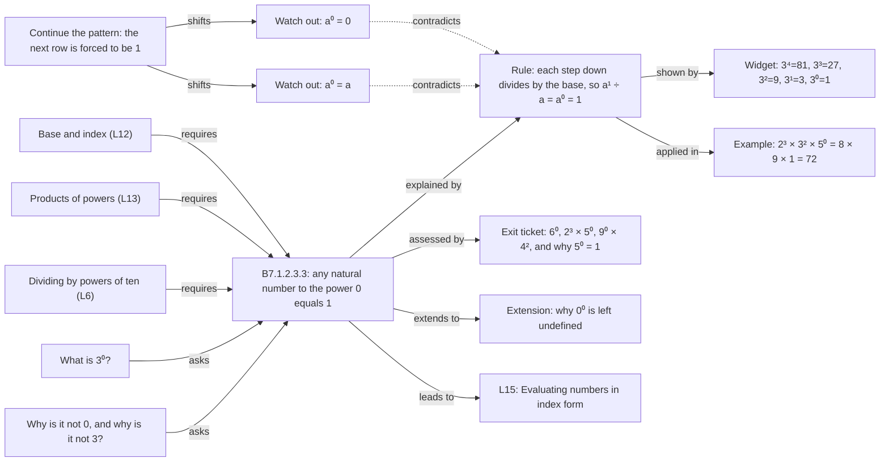
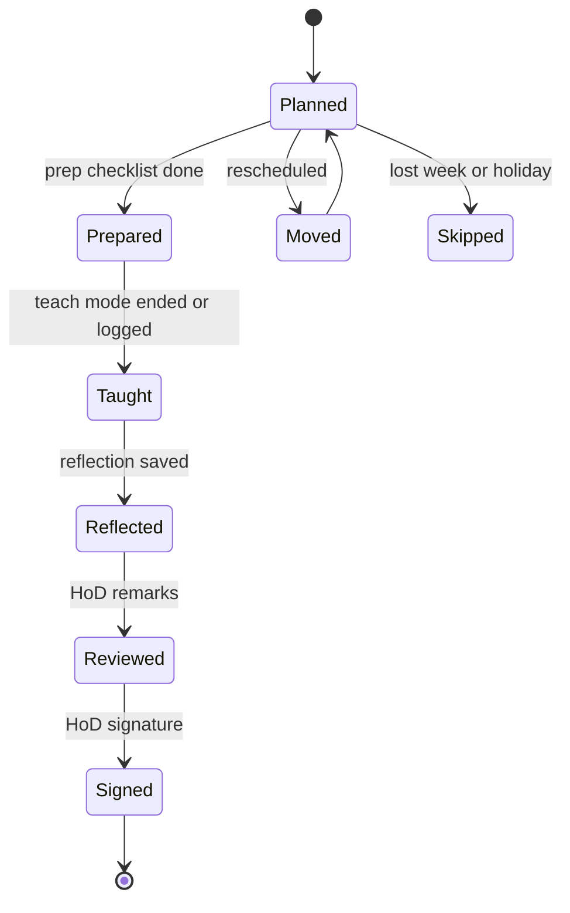
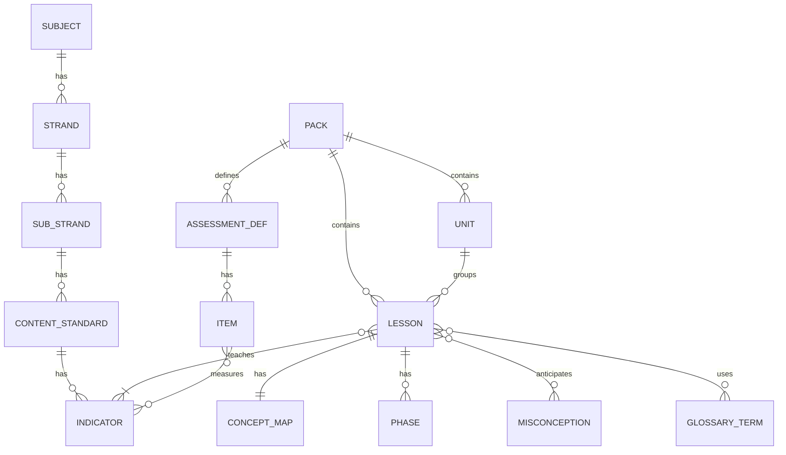
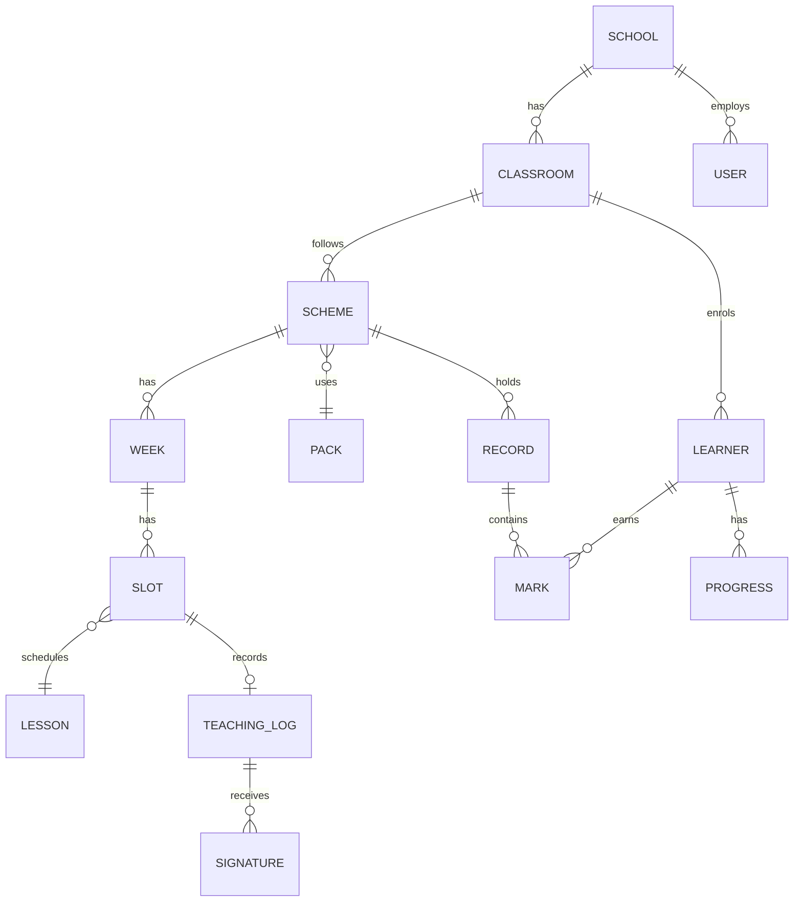
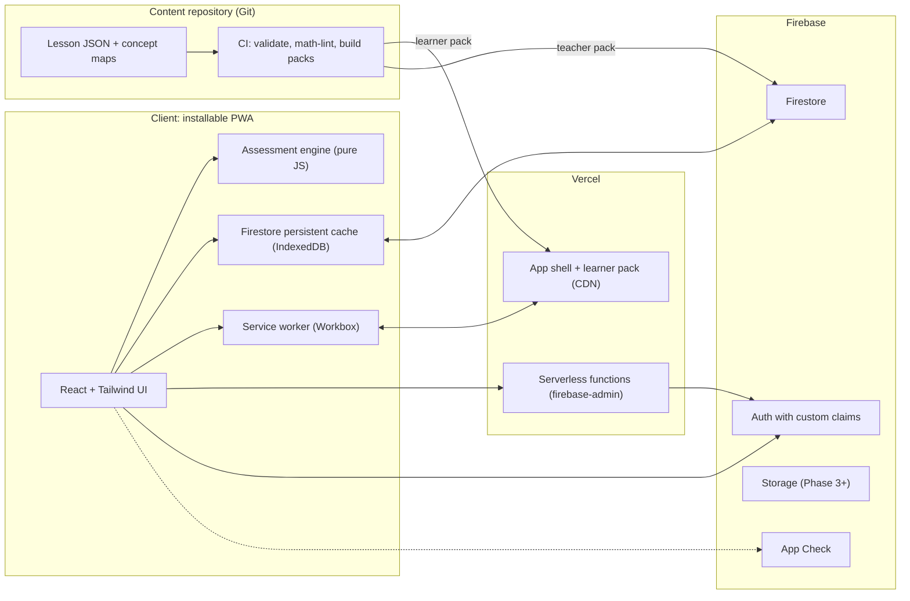

# Product Design Document (PDD)

## NaCCA Teaching Tool and Student Learning Portal — working title **MapLearn**

| | |
|---|---|
| **Version** | 0.2 — draft, updated after whole-repository source audit |
| **Date** | 23 September 2026 |
| **Status** | Future school product: full release blocked. A restricted, unauthenticated **public preview** of approved learner-safe B7 Maths excerpts is implemented; see [README](README.md). Source audits and open decisions remain in the [Phase-0 register](docs/phase0-decisions.md). |
| **Stack (fixed by brief)** | React (JavaScript) · Tailwind CSS (latest) · lucide-react · Firebase · Vercel · PWA |
| **Basis** | The **22 original files at discovery** (before the Phase-0 tools/docs were added): four Term 1 plan/notes/tracker sets, two curriculum PDFs, two annual-scheme PDFs, a corrected B4–B8 maths-scheme workbook, two supplementary DOCX files, two images, and this PDD. The first draft analyzed only four of these. |

**How to read this document.** This is the **longer-term school-product blueprint, not a list of features implemented today**. §1–3 explain what was found and why. §4–9 describe the future product; §10–14 its proposed architecture. §15–19 cover content, delivery, risk and open decisions. The appendices hold the term map, a sample lesson record, a security-policy checklist and indicator analysis. The [raw-source audit](docs/source-audit.json) is a known-bad baseline, not a content-approval certificate.

**September 2026 launch carve-out.** The user authorized publication of learner-safe lesson/NaCCA excerpts **with attribution**, excluding tests, keys and staff notes, and directed us to **omit authentication for now**. The built public preview implements only a 24-lesson B7 Maths scheme, indicator/vocabulary/prerequisite maps, four curated ungraded models, and a 5E timing display. It has no Firebase, accounts, marks, private content, GES exports, authoring, school release controls or secure role model. See [TODO-Benched-For-Later.md](TODO-Benched-For-Later.md) before treating this PDD as a school deployment plan.

**Assumptions made (please correct any that are wrong).**

- **A1.** "Each component … will feature an interactive concept map" means **each lesson**, with roll-up maps at week, unit and term level.
- **A2.** "PDD" means Product Design Document covering product, UX, data and technical design.
- **A3 (revised).** Full Term 1 lesson plans, GES notes and trackers exist for Basic 7 Mathematics (24 lessons/24 tracker indicators), Basic 7 Science (24/17), Basic 8 Mathematics (24/21), and Basic 8 Science (26/22). Their quality varies; **available does not mean approved**. No Term 2 lesson pack is present. The platform remains multi-subject/multi-class/multi-term by design, with the first approved vertical slice on Mathematics.
- **A4.** Users are Ghanaian JHS teachers and learners (about 11–15 years old) on mostly low-to-mid-range Android phones, with unreliable connectivity, and sometimes one shared projector per classroom.

---

## 1. Executive summary

**What we are building.** One installable web app (PWA) with two faces on a single curriculum-native content model:

- **Teacher Studio** — the scheme of work, lesson workspace, classroom "Teach mode", GES-format lesson notes, weekly record of work, coverage matrix, class assessment record and indicator analysis.
- **Learner Portal** — the same lessons in learner language, with the interactive concept map, interactive versions of the lesson figures, self-assessment, practice and progress.

**The differentiator.** Every lesson becomes an **interactive concept map** built from structured lesson data: the indicator at the centre, the vocabulary, prerequisites, rules, worked examples, misconceptions and assessments around it. The 13 static figures in the Mathematics pack become data-driven interactive widgets. The tracker's formulas move into a tested assessment engine that also automates the "which indicator is weakest?" analysis that teachers currently do by hand.

**Four findings from the source documents that shape the design.**

1. **The content is structured but not uniform.** A five-part indicator code (`B7.1.2.3.4`) encodes level, strand, sub-strand, content standard and indicator. Basic 7 Mathematics is 24 indicators/24 lessons; other packs legitimately repeat indicators across lessons and Basic 8 Science has 26 lessons (§2.3).
2. **Weeks, lessons and units are independent.** Mathematics Unit boundaries fall *inside* Weeks 3 and 6, while Basic 8 Science has a 13th teaching week. A scheme stores scheduling and grouping separately (§2.2).
3. **Raw source errors extend beyond the original four-document sample.** Eleven of 16 unit tests have question-mark sums different from their stated maxima; *all four* exams have item totals different from the trackers' 100-mark setting. Covers, weekly records and a corrected scheme also disagree (§2.6; [audit](docs/source-audit.json)). A **strict validator for approved normalized content** is a Phase-0 gate; a passing *raw-source baseline check* is not an approval.
4. **Marking schemes and exam answers cannot live in a public bundle.** Teacher-only content needs gated delivery, including protection on shared offline devices (§10.3, §13).

**Recommended MVP ("Teach Kit", Phase 1).** Sign-in and class setup → scheme of work → lesson workspace → concept map for 24 **approved** Basic 7 Mathematics lessons → Teach mode with data-driven 5E phase timer → offline term pack → teaching log, reflection, weekly record and coverage matrix → GES lesson-note PDF. The class assessment engine follows in Phase 2; learner accounts in Phase 3; the other **existing but unapproved** subject packs and the in-app authoring CMS are Phase 4. The original 32–40 week estimate is provisional pending source corrections and scope re-estimation (§17).

**Decisions still needed for the full school product (full list in §19):** canonical test scope and item/section/total marks across packs; disputed schedules; author-confirmed keys; broader rights; learner data and release semantics; and hosting cost. Do not publish **full source packs, assessments, staff material or learner records** until the [decision register](docs/phase0-decisions.md) and security gates are resolved. The separately authorized *restricted public preview* follows the narrower allowlist above.

---

## 2. What the source documents contain

### 2.1 Inventory

| Source group | What is present | Shape / role |
|---|---|---|
| **B7 Mathematics Term 1** | Lesson Plan and Teaching Guide (A teaching guide, B lessons, C tests/exam/rubrics/checklists, D records), GES Lesson Notes, Assessment Tracker | 24 lessons, 24 indicators, 13 figures; the original detailed worked example for this design |
| **B7 Science Term 1** | The same three document types, with a different annex structure | 24 lessons, **17** tracker indicators, 16 embedded images in the plan; 5E timings 8/18/12/12/10; tracker classwork maximum 170 |
| **B8 Mathematics Term 1** | Plan, notes and tracker | 24 lessons, **21** tracker indicators; curriculum and corrected-scheme conflicts require review |
| **B8 Science Term 1** | Plan, notes and tracker (not just a tracker) | **26** lessons, **22** tracker indicators, **13** teaching weeks; significant marks and copied-header issues |
| **Curriculum and schemes** | `MATHEMATICS.pdf`, `SCIENCE.pdf`; Basic 7 and Basic 8 annual-scheme PDFs; corrected B4–B8 Mathematics schemes (all three terms) workbook | Use official curriculum statements for provenance; arbitrate differences between corrected schemes, plans and trackers before import |
| **Supporting artefacts** | Basic 7 Mathematics first-term outline, Little Gems timetable, `mind-map.png`, `plant-slide.png` | Scheduling context and static imagery; neither image is an implemented interactive map |

The first draft studied only B7 Mathematics plan/notes/tracker and the B8 Science tracker. §§2.2–2.6 below retain that Maths worked example but must now be read alongside [the complete raw-source audit](docs/source-audit.json). Extracted lesson text is relatively small, so a validated term *may* be suitable for offline download; the ≤5 MB and performance targets must still be measured against an actual built pack.

### 2.2 Curriculum spine and code grammar

Indicator codes follow one grammar in both subjects:

```
B7 . 1 . 2 . 3 . 4
│    │   │   │   └─ indicator            (B7.1.2.3.4  "Find the value of a number written in index form")
│    │   │   └───── content standard     (B7.1.2.3    "…powers of natural numbers…")
│    │   └───────── sub-strand           (B7.1.2      Number Operations)
│    └───────────── strand                (B7.1        Number)
└────────────────── level                 (B7 = Basic 7)
```

Content standards are three-to-four-part codes (`B7.1.1.1`), so parents can be derived from any indicator code. This gives us a free integrity check (§15, rule V1).

**Basic 7 Mathematics Term 1 — the actual shape:**

| Sub-strand | Content standard | Indicators | Weeks | Lessons | Unit |
|---|---|---:|---|---|---|
| 1.1 Numeration Systems | B7.1.1.1 | 5 | 1–3 | L1–L5 | Unit 1 |
| 1.2 Number Operations | B7.1.2.1 | 3 | 3–4 | L6–L8 | Unit 2 |
| 1.2 Number Operations | B7.1.2.2 | 3 | 5–6 | L9–L11 | Unit 2 |
| 1.2 Number Operations | B7.1.2.3 | 5 | 6–8 | L12–L16 | Unit 3 (Powers) |
| 1.3 Fractions | B7.1.3.1 | 2 | 9 | L17–L18 | Unit 4 |
| 1.3 Fractions | B7.1.3.2 | 2 | 10 | L19–L20 | Unit 4 |
| 1.3 Fractions | B7.1.3.3 | 4 | 11–12 | L21–L24 | Unit 4 |

That is 1 strand, 3 sub-strands, 7 content standards, 24 indicators and 24 lessons: **one indicator per lesson for this pack**, two lessons per week for 12 teaching weeks. Its *plan* calls Week 13 revision, Week 14 examination and Week 15 vacation; the corrected scheme and PDF instead mark Week 15 as examination (S-11). The pilot calendar is **unresolved**, not hard-coded.

**Design consequences.**

- **Units are not sub-strands.** Units 2 and 3 both sit inside sub-strand 1.2.
- **Units are not nested in weeks.** Week 3 holds L5 (Unit 1) and L6 (Unit 2); Week 6 holds L11 (Unit 2) and L12 (Unit 3). A `Lesson` therefore has *both* a `weekNumber` (schedule) and a `unitId` (pedagogic grouping).
- **Sequence lives in the scheme, not in the code.** In the Science tracker, Unit Test 4 covers strand 5 (waste, communicable diseases) *and* strand 2 (seed beds, animal feed), so code order is not teaching order.
- **"Varied number of weeks per term" is data, not code.** Week count, week types (teaching, revision, assessment, vacation) and lessons per week are all configuration.

**Basic 8 Science Term 1 (tracker and lesson documents).** 22 distinct tracker indicators across strands 1–5; the supplied plan teaches these in **26 lessons over 13 teaching weeks**, sometimes two lessons per indicator. UT1 (20) covers mixtures, carbon cycle and *Anopheles*; UT2 (20) the mammalian tooth; UT3 (30) energy, heat and temperature; UT4 (30) waste, communicable disease, seed beds and animal feed. The tests' printed question marks do **not** add up to those maxima (§2.6). The strand and sub-strand names need verification against `SCIENCE.pdf` and the scheme before import.

### 2.3 Anatomy of a lesson (union of both Word documents)

The following describes **the 24 B7 Mathematics lessons** studied in the first draft. Its Notes document adds the fields marked ★. The other three packs have similar templates, but no importer may assume 24 lessons, one indicator per lesson, identical annexes or identical phase minutes: B7 Science uses 8/18/12/12/10; B8 Science has 26 lessons; and multi-lesson indicators occur in all three additional packs.

| Group | Fields | App treatment |
|---|---|---|
| Identity | Lesson no., title, week, duration (60 min), unit | Scheme slot + lesson header |
| Curriculum | Strand, sub-strand, content standard (code + verbatim text), indicator(s) (code + verbatim text), curriculum page reference ★ | **Pinned header on every lesson view** (per the brief) |
| Outcomes | Performance indicator; objectives typed **K** (knowledge), **S** (skill), **A/V** (attitude/value); core competencies (CP, CC, PL, CI seen) | Overview panel; learner-language "You will be able to…" |
| Language | Key vocabulary; **two essential questions** ★ | Concept nodes; word wall; map roots |
| Preparation | Prior knowledge (names earlier lessons *and* earlier grades); TLM/resources; pedagogical exemplars ★ | Prerequisite edges; prep checklist |
| The lesson | Five **5E phases** (B7 Maths: Engage 8 · Explore 16 · Explain 14 · Elaborate 12 · Evaluate 10 = 60 min; **minutes are lesson data**), each with teacher activity and learner activity; per phase: core competency ★, assessment mode ★, **DoK** level ★ | Teach-mode timeline; DoK analytics |
| Differentiation | Support (AP), Core (P), Extension (HP) | Three tabs; drives grouping suggestions |
| Assessment | Success criteria, exit ticket, checklist code (C7.1–C7.24) | Exit-ticket capture; observation checklist |
| Extension | Homework/project; cross-curricular links and values; lesson closure ★ | Learner homework; links panel |
| Figures | 13 static figures across 13 lessons | 13 interactive widgets (§7.5) |
| Admin block ★ | Week ending, day, date, period, duration, class size (boys / girls / total) | Auto-filled from class roster and timetable |
| Teacher completes | Reflection (what went well · what I'd change · learners needing follow-up), HoD remarks, name/signature row | Teaching log + sign-off workflow |

### 2.4 Term-level artefacts and where they go

| Source | Content | Module |
|---|---|---|
| A1 Curriculum alignment; D1 Coverage matrix | Standards/indicators, lesson, week, assessed-by, annexes, **date taught** | Scheme validator; auto-filled coverage matrix (DOC) |
| A2 Term at a glance; unit intros | 4 units, objectives, **assessed unit product** each | Unit pages; product tracking |
| A3–A5 Philosophies, methods, inclusion | Five traditions; 8 methods; AP/P/HP; six barriers with free adjustments | Teacher guide library; barrier tips surfaced in lessons |
| A6 Assessment plan | Calendar and weighting | Assessment config |
| A7 Resources | Low-cost improvisation | Prep checklist |
| A8 **Misconceptions** (12) | Misconception → why held → experience that shifts it | **Misconception nodes in concept maps; feedback for wrong answers** |
| A9 Glossary (30) | Word wall terms | Glossary + concept-node definitions |
| C1–C2 Tests and exam | Questions with mark schemes; 20 MCQ + 5 structured | Question bank (teacher-gated) |
| C3 Rubrics R1–R3 | Four-level rubrics; level→mark rule | Rubric scoring |
| C4 Checklists C7.1–C7.24 | One line per lesson | Observation capture |
| D2 Weekly record (Weeks 1–15) | Week, date, lessons, indicators, assessment set, notes, three signatures | Auto-generated record + sign-off |
| D3 / trackers | Class record | Assessment engine |

### 2.5 The assessment model in the trackers

| Pack | Unit-test maxima UT1/UT2/UT3/UT4 **in tracker** | Tracked rubric maxima | Classwork total | Tracker exam max |
|---|---|---|---:|---:|
| B7 Mathematics | 20 / 30 / 20 / 30 | R1/R2/R3 = 10 / 10 / 20 | 140 | 100 |
| B7 Science | 20 / 20 / 30 / 20 | R1/R3/R4/R6/R7 = 10 / 20 / 10 / 20 / 20 | **170** | 100 |
| B8 Mathematics | 20 / 20 / 30 / 30 | R1/R2/R3 = 10 / 10 / 20 | 140 | 100 |
| B8 Science | 20 / 20 / 30 / 30 | R1/R2/R3 = 10 / 10 / 20 | 140 | 100 |

These are *spreadsheet settings*, **not approved exam or test totals**. In particular B8 Mathematics Part C declares UT2/UT3 as 30/20, versus 20/30 in its tracker. The following calculation logic was recovered from the B7 Mathematics spreadsheet; the other trackers use the same approach with their own maxima:

- `Classwork % = (UT1+UT2+UT3+UT4+R1+R2+R3) / 140 × 100`
- `Exam % = Exam / 100 × 100`
- `Term % = Classwork % × 50% + Exam % × 50%` (weights live in Settings). It is only computed once the exam mark exists.
- **Grade** = lookup on lower bounds: 0 *Needs urgent support* · 40 *Below pass* · 50 *Pass* · 65 *Credit* · 80 *Distinction*.
- **Comment** = "Needs support — see Indicator Analysis" when Term % is under the pass mark (50).
- **Class summary:** learners entered, average, highest, lowest, count and rate at or above pass mark, count under 40 (the follow-up list), average per assessment and as % of maximum.
- **Indicator Analysis:** for each of 24 (Maths) or 22 (Science) indicators, the teacher enters "marks for this indicator" and "class mean"; the sheet computes mean %, then **< 40 → RE-TEACH FIRST · < 55 → Reteach briefly · otherwise Secure**, and names the weakest indicator.
- **Distribution:** counts and % in each grade band, plus a chart.

Two behaviours the app should **improve rather than copy**:

1. The classwork denominator is fixed at the pack's configured maximum (**140 or 170 here**), so a learner with only UT1 entered shows a misleadingly low classwork %. The app will show **provisional** vs **final** marks (§8.2).
2. The "below 40%" follow-up count is hard-coded while the pass mark is configurable. The app makes every threshold a setting.

### 2.6 Source-data issues to resolve before import

I re-computed every answer in the four unit tests and the exam, and checked mark totals. These are **findings from my own arithmetic — the author should confirm each one before content is corrected.**

| ID | Severity | Issue | Evidence |
|---|---|---|---|
| **S-01** | High | **Unit-test scope differs between plan and tracker.** The plan's Part C and assessment calendar say UT1 Numeration (20, Wk 3) · UT2 Operations (30, Wk 6) · **UT3 Powers (20, Wk 8)** · UT4 Fractions (30, Wk 12). The tracker says UT2 covers "mental, written, **powers**", **UT3 "Fractions: comparing and ordering"** (20) and **UT4 "Fractions: the four operations"** (30), and assigns B7.1.2.3.x to UT2 and B7.1.3.1.x to UT3 | Plan A6, C1; tracker Settings and Indicator Analysis |
| **S-02** | High | **Ten answer keys disagree with the printed question** (table below) | Part C1.1, C1.4, C2.1 |
| **S-03** | High | **Mark totals do not add up.** UT2 questions sum to **29** (stated 30). UT4 questions sum to **37** (stated 30). Exam Section B sums to **30** (stated 40), so the exam totals **50**, not 100 | Recomputed from question marks |
| **S-04** | Medium | **Ambiguous MCQ.** Exam Q4 "Which is the largest?" offers both ½ (A) and 0.5 (D), which are equal; the key says D | C2.1 Q4 |
| **S-05** | Medium | **"⅔" appears where ¾ is computed.** Besides the items below, Lesson 18 lists "⅔ = 75%", Lesson 23 works "½ ÷ ⅔ = ½ × 4/3", and Lesson 24 works "10 ÷ ⅔ = 10 × 4/3 = 40/3 = 13⅓". All three are arithmetically ¾ (10 ÷ ⅔ is 15). The pattern looks like a systematic character substitution | Raw document XML confirms the glyph is in the source, not an extraction artefact |
| **S-06** | Medium | **Lesson Notes metadata is wrong.** The cover says Subject: **Science** and refers to "Basic 7 Science", and cites the curriculum as "February 2020". The lesson rows say Mathematics and September 2020 | Notes cover page |
| **S-07** | Low | Plan A2 labels all four units "Unit 1". D1's key says checklists are "C6" (they are in C4). D2 mentions **R4** (only R1–R3 exist). Four unit products exist but only three rubrics, and the product↔rubric mapping is not stated | A2, D1, D2, C3 |
| **S-08** | Low | **Figure 1.1 mis-groups digits.** The rendered figure shows 2 486 309 175 as 248 · 630 · 917 · 5, grouping from the left instead of periods from the right. A static figure is teaching the wrong periods | Figure image 1 |
| **S-09** | Info | Week 12 was duplicated in the circulated scheme; the authors corrected it. Keep it as a permanent validator rule | Plan A1.3 |
| **S-10** | **Blocker** | Across all four packs, **11 of 16 unit tests** have printed question marks inconsistent with their stated totals. Every exam's question marks differ from the tracker's 100-mark expectation. B8 Maths UT2/UT3 maxima additionally disagree between its plan and tracker | [Raw-source audit](docs/source-audit.json), all plans Part C and trackers `Class Record` row 4 |
| **S-11** | High | B8 Mathematics Week 12 teaches gradient in its plan and tracker, but angles in `B8 CORRECTED` (Mismatch Register M26). B7 Mathematics Week 15 is vacation in its plan, examination in `B7 CORRECTED` and the scheme PDF | Plans A1.1/D2; corrected workbook rows 13/16 |
| **S-12** | High | B8 plan covers and weekly records retain B7/Mathematics text. B8 Science notes have L25 and L26 labelled “of 24”; several notes have wrong class or subject headers. B7 Science D1.1 says 14 indicators while its matrix and tracker list 17 | Plans covers/A6/D2/D1; Notes covers and lesson headings |
| **S-13** | Medium | Lesson/indicator cardinality and 5E splits vary legitimately by pack. The Maths-specific “exactly once” rule would reject 24 B7 Science lessons/17 indicators, 24 B8 Mathematics lessons/21 indicators, and 26 B8 Science lessons/22 indicators | All plans D1 and Part B; §15 rule V2 must be scoped |
| **S-14** | Medium | Several documents cite a February 2020, B7–10 curriculum even though the supplied Maths and Science PDFs' covers identify September 2020, B7–B9 | Plan/notes citations; curriculum PDF covers |

**Additional mark-total evidence (all figures sum the marks printed on the actual questions):**

| Pack | UT1 / UT2 / UT3 / UT4 item sums | Exam item sum | Tracker exam maximum |
|---|---|---:|---:|
| B7 Mathematics | 20 / **29** / 20 / **37** | **50** | 100 |
| B7 Science | **24** / 20 / 30 / **24** | **70** (paper claims 50) | 100 |
| B8 Mathematics | 20 / **34** / **22** / **31** | **79** | 100 |
| B8 Science | **28** / **29** / **32** / **43** | **78** | 100 |

These counts do not themselves decide whether the questions, their marks, or the spreadsheet settings should change. A subject author must approve each correction before import. `tools/source_audit.py` reproduces the inventory from the original, unchanged DOCX/XLSX; CI only guards against unreviewed changes to that **known-bad raw-source baseline**, not against publication of bad normalized content.

**S-02 detail** (each key fits ¾ or the corrected value, which suggests a typing/substitution fault rather than a marking fault):

| Item | Printed | Key given | What the printed question actually gives |
|---|---|---|---|
| UT1 Q3 | Value of digit 7 in 37,482,105,600 | 7 hundred million | 7 billion (the 7 is in the billions place) |
| UT4 Q2 | Write ⅔ as decimal and % | 0.75 and 75% | 0.666… and 66⅔% (key is for ¾) |
| UT4 Q5 | 3⅔ − 1½ | 2¼ | 2 1/6 (key is for 3¾ − 1½) |
| UT4 Q9 | ⅔ of GH₵ 320 | GH₵ 240 | GH₵ 213.33 (key is for ¾) |
| UT4 Q12 | ½ ÷ ⅔ | 2/3 | ¾ (key is for ½ ÷ ¾) |
| UT4 Q13 | 6 kg in ⅔ kg bags | 8 bags | 9 bags (key is for ¾ kg) |
| Exam Q1 | 5,072,400,318 in words | B | A is the correct wording |
| Exam Q6 | 2/3 + ¾ | C (1 5/7) | 1 5/12, which is option B |
| Exam Q7 | ⅔ of GH₵ 240 | A (GH₵ 180) | GH₵ 160, which is option D (key is for ¾) |
| Exam Q8 | 6 ÷ ¼ | D (8) | 24, which is option C (key is for 6 ÷ ¾) |

An **exact-arithmetic math linter** can catch structured fraction and calculation errors, but “write a number in words”, visual models and open-ended explanations are not automatically verified by a fraction parser. Use typed item data and independent human review for those. Math-lint and item-total checks remain core deliverables (§15).

---

## 3. Product vision, goals, non-goals and metrics

**Vision.** *Every Ghanaian JHS teacher can see, teach, assess and record a lesson from one place, and every learner can see how an idea connects to the ideas around it.*

**Goals**

| # | Goal | Measured by |
|---|---|---|
| G1 | Make the NaCCA hierarchy (strand → sub-strand → content standard → indicator → lesson → week → term) navigable and always visible | Every lesson view shows the four curriculum fields with codes |
| G2 | Make every lesson explorable as an interactive concept map, for teachers and learners | 100% of lessons have a lint-passing map; map opened in ≥ 60% of taught lessons (pilot) |
| G3 | Paper parity: everything a teacher must submit or keep can be produced from the app | Lesson notes, weekly record, coverage matrix and class record export in GES layout |
| G4 | Turn assessment data into a re-teach decision | Weakest indicator surfaced with linked lesson(s) without manual calculation |
| G5 | Work in a classroom with unreliable data and power | Full term usable offline after one download |
| G6 | Be correct | Zero known answer-key or arithmetic errors in shipped content (validator gate) |

**Non-goals (v1).** Chat, forums or social features for learners. Fee, attendance or timetable management beyond what the lesson note needs. Live video. A generative AI tutor for learners. Native iOS or Android apps. Replacing the curriculum: NaCCA content is attributed, versioned and linked.

**Design principles.**

1. **Board-first.** Teach mode must be readable from the back of a classroom.
2. **Same data, three lenses.** One content record renders as teacher plan, projector view or learner view.
3. **Concrete → pictorial → abstract.** The pack's CPA method also shapes the widgets: manipulatives first, symbols last.
4. **Misconception-aware.** Wrong answers get targeted feedback built from A8, not just "incorrect".
5. **Calm, not competitive.** No leaderboards. The teaching guide warns about mathematics anxiety, so progress is private to the learner and teacher.
6. **Data-light.** Small bundles, no video by default, downloadable packs.
7. **Ghanaian context.** GH₵ amounts, local examples, English vocabulary with a path to home-language glosses.

**Pilot success metrics (initial hypotheses to be tuned).**

| Metric | Target |
|---|---|
| Teacher opens next lesson and reaches "ready to teach" | ≤ 5 minutes |
| Assessment entry for one class of 45 on one test | ≤ 10 minutes |
| Weekly record of work produced without retyping | 100% of weeks |
| Lessons logged (taught/reflected) within 48 h | ≥ 70% |
| Concept map opened per taught lesson | ≥ 60% |
| Learner weekly active rate (pilot classes with devices) | ≥ 50% |
| Cold-start offline success after one download | 100% of pilot devices |
| Shipped content errors found in pilot | 0 open blockers |


---

## 4. Users, roles and permissions

### 4.1 Primary personas

| Persona | Context | Needs from the product |
|---|---|---|
| **Class teacher** (e.g., Basic 7 Maths, 2–3 classes) | Android phone, occasional projector, patchy data, paperwork due to HoD every week | Know what to teach this week; see how ideas connect; run the lesson; capture the exit ticket; have the paperwork already filled in |
| **Learner** (12–14 years) | Shared or family phone, may have no email address | See what today's lesson is for; explore the idea; check "I can…"; practise; review before tests |
| **Head of Department** | Reviews notes and records for several teachers | See coverage and lag; add remarks; sign |
| **Head teacher / Principal** | Signs the weekly record | See term-level coverage and results at a glance |

### 4.2 Roles and access

| Capability | Learner | Teacher | HoD | Head teacher | School admin | Content editor | Platform admin |
|---|:-:|:-:|:-:|:-:|:-:|:-:|:-:|
| Browse curriculum, scheme, learner-view lessons | ✔ (own class, released) | ✔ | ✔ | ✔ | ✔ | ✔ | ✔ |
| Teacher-only content (notes, mark schemes, exam) | ✘ | ✔ (own subjects) | ✔ | ✘ | ✘ | ✔ | ✔ |
| Teach mode; exit-ticket capture | ✘ | ✔ | ✘ | ✘ | ✘ | ✘ | ✘ |
| Enter and see scores | Own only | Own classes | Dept. classes (read) | School (read) | ✘ | ✘ | ✘ |
| Teaching log and reflection | ✘ | ✔ | Review | Read | ✘ | ✘ | ✘ |
| HoD remarks and signature | ✘ | ✘ | ✔ | ✘ | ✘ | ✘ | ✘ |
| Sign weekly record | ✘ | Class-teacher sign | Sign | Sign | ✘ | ✘ | ✘ |
| Manage users, classes, rosters | ✘ | Own roster | ✘ | ✘ | ✔ | ✘ | ✔ |
| Author and publish content | ✘ | Personal overlays | ✘ | ✘ | ✘ | ✔ | ✔ |

Roles are enforced in three places: Firebase Auth custom claims, Firestore security rules, and UI route guards. The UI guard is a convenience only; the rules are the control (§13).

---

## 5. Scope and release plan

### 5.1 Release plan (MoSCoW against phases)

| Phase | Theme | Must | Should | Could |
|---|---|---|---|---|
| **0** | Discovery and content foundations | Audit all four existing packs; resolve the **B7 Maths** item/answer/schedule blockers with the author; validate normalized B7 Maths JSON; schema and design spikes; decisions C1–C4 logged | Map prototype on 3 approved lessons; reconciliation plan for other packs | — |
| **1 — MVP "Teach Kit"** | Teacher can plan, teach and record | Auth and school/class setup; curriculum + scheme; lesson workspace; maps for **24 approved Maths lessons**; Teach mode; offline pack; teaching log + reflection; **weekly record and coverage matrix**; GES lesson-note PDF; 4 widgets | DOCX export; prep checklist; glossary | Personal overlays |
| **2** | Assessment and expanded records | Class record; settings; grade/distribution; summary; indicator analysis (manual + item-level); XLSX record export/import; HoD sign-off | Rubrics; term-end pack | Item statistics |
| **3** | Learner Portal | Learner login; lessons released for display (CDN pack is not secret); learner map lens; "I can" ticks; practice/exit-ticket quizzes; offline | All 13 Maths widgets; homework; word wall; per-indicator progress | Parent view; revision mode |
| **4** | Scale | **Reconcile, validate and import the existing B7 Science, B8 Mathematics and B8 Science Term 1 sources**; ship a second approved subject without engine/schema changes | In-app authoring CMS; week/unit/term maps; usage dashboard | Home-language glossary; district roll-ups |

### 5.2 Explicitly out of MVP

Learner-facing digital tests and exams (integrity and device-parity risks), photo submission of homework, parent accounts, AI-drafted content, and any payment flow.

---

## 6. Functional requirements

Priority is **relative to each module's release phase**, not a claim that every P0 feature ships in Phase 1: **P0** = required in its phase, **P1** = next increment, **P2** = later. §5 gives the ship phase (e.g., P0 ASM-* is Phase 2; P0 LRN-* is Phase 3). The concept map (MAP-*) and assessment engine (ASM-*) are specified in full in §7 and §8.

### 6.1 Curriculum and Scheme of Work (CUR)

| ID | Pri | Requirement |
|---|---|---|
| CUR-1 | P0 | Store the curriculum spine (strand → sub-strand → content standard → indicator) with codes parsed from the grammar in §2.2. Browse and search by code or keyword |
| CUR-2 | P0 | A **Scheme** belongs to one class + subject + term. It has *N* weeks, each typed *teaching / revision / assessment / vacation / holiday*, each with *k* lesson slots (Maths default k = 2). Week count, types and *k* are configuration |
| CUR-3 | P0 | Week view lists each lesson with title, **strand, sub-strand, content standard, indicator(s)**, unit, and any assessment due that week |
| CUR-4 | P0 | **Coverage validator**: compare planned lesson↔indicator links to the approved scheme. Flag missing, unexpected or duplicated *slots* and partly covered standards. Several approved lessons may intentionally teach one indicator (e.g., B8 Science L1–L2); never enforce “one lesson per indicator” across subjects |
| CUR-5 | P0 | **Unit** is a first-class grouping (objectives, assessed product, unit test) independent of weeks |
| CUR-6 | P1 | Move, swap or skip a lesson; scheme re-flows; reason logged; catch-up suggestions when weeks are lost |
| CUR-7 | P1 | Term calendar with dates and holidays; "week ending" dates derived automatically |
| CUR-8 | P1 | Clone a scheme to another class or next year; import a scheme from CSV/XLSX |
| CUR-9 | P2 | Subject-year map across terms |

### 6.2 Lesson workspace (LES)

| ID | Pri | Requirement |
|---|---|---|
| LES-1 | P0 | Sticky lesson header shows **Strand · Sub-strand · Content standard · Indicator(s)** with codes, verbatim text and curriculum page reference |
| LES-2 | P0 | Sections: Overview · Concept map · 5E plan · Differentiation · Assessment · Homework · Links and values · Misconceptions · Reflection |
| LES-3 | P0 | 5E plan is a timeline with teacher and learner columns; each phase shows minutes, core-competency chips and DoK level |
| LES-4 | P0 | Each content block has an **audience**: `learner`, `teacher`, or `both`. Teacher-only blocks are never sent to learner clients (§10.3) |
| LES-5 | P0 | Export the lesson as a **GES-format lesson note** (PDF) with admin block pre-filled from the class roster and scheme |
| LES-6 | P1 | DOCX export of the same note |
| LES-7 | P1 | Personal overlay: a teacher edits their own copy of a lesson; diff against canonical; one-tap reset |
| LES-8 | P1 | Week-ahead **prep checklist** from TLM (gather / make / print) with improvisation tips from A7 |
| LES-9 | P1 | Key vocabulary resolves to glossary definitions; hover/tap shows the definition |
| LES-10 | P2 | Attach personal files or photos to a lesson |

### 6.3 Teach mode (TCH)

| ID | Pri | Requirement |
|---|---|---|
| TCH-1 | P0 | Full-screen presenter view with large type. Five phase steps use **their lesson's stored minutes** (B7 Maths 8/16/14/12/10; B7 Science 8/18/12/12/10). Visual and optional audio cue at phase end. Pause, skip and screen wake-lock |
| TCH-2 | P0 | Projector-safe by default: no answers, marking schemes or private notes on screen. Teacher notes shown on the teacher's device only, or behind a toggle |
| TCH-3 | P0 | Launch the lesson's concept map and interactive widget inline during Engage or Explain |
| TCH-4 | P0 | **Exit-ticket capture**: a roster grid where the teacher taps each learner into *Got it / Nearly / Not yet* (the "three piles" in the pack). Optionally tick the named success criteria |
| TCH-5 | P1 | Period-split option (the notes suggest splitting at EXPLAIN for shorter periods); duration scaling |
| TCH-6 | P1 | Observation checklist (C7.x) capture per learner during Explore/Elaborate, date-stamped |
| TCH-7 | P1 | **Group maker** for pairs and groups with the pack's roles (Recorder, Reporter), optionally seeded by the AP/P/HP grouping. Random single-learner pickers are *off* by default: the guide advises against cold-calling |
| TCH-8 | P0 | Fully functional offline |

### 6.4 Learner Portal (LRN)

| ID | Pri | Requirement |
|---|---|---|
| LRN-1 | P0 (Phase 3) | Sign-in by **class code → pick your name → PIN**, provisioned by the teacher; no email required (§13.2) |
| LRN-2 | P0 | "My term": weeks and lessons released by the teacher or by date; learner-view lesson page with "By the end you will be able to…", vocabulary, essential questions, concept map (learner lens) and widgets |
| LRN-3 | P0 | **"I can…" self-assessment**: ticks drawn from each lesson's exit-ticket statements (e.g., *I can read a number to billions / write it in words / build it with blocks*). Visible to the teacher |
| LRN-4 | P1 | Practice items and digital exit tickets, auto-marked for numeric and multiple-choice answers, with **misconception-targeted feedback** (e.g., answer "2³ = 6" → shows 2 × 2 × 2 built with counters) |
| LRN-5 | P1 | Homework list and completion tick; text submission (photo P2) |
| LRN-6 | P1 | Word wall/glossary with search, available offline |
| LRN-7 | P1 | Progress by **indicator** (*Not yet / Nearly / Got it*), private to learner and teacher. No rankings |
| LRN-8 | P0 | Offline: downloaded lessons open without a network; answers queue and sync later |
| LRN-9 | P2 | Revision mode mirroring the Week 13 stations; home-language glosses; audio pronunciation |

### 6.5 Compliance documents and workflow (DOC)

| ID | Pri | Requirement |
|---|---|---|
| DOC-1 | P0 | **Teaching log** per lesson slot: status (*planned / taught / moved / skipped*), date, day, period, week ending, class size boys/girls/total (from roster), notes |
| DOC-2 | P0 | Reflection with the three prompts; "learners needing follow-up" picks from the roster and feeds the next lesson |
| DOC-3 | P0 | **Weekly Record of Work** (Weeks 1–15) auto-generated from scheme + log: week, date, lessons, indicators taught, assessment/homework set, notes |
| DOC-4 | P0 | **Coverage matrix** (D1) with *date taught* auto-filled; export to PDF in Phase 1, XLSX in Phase 2 |
| DOC-5 | P1 | HoD review queue: remarks and e-signature; Head teacher signs the weekly record; **immutable audit trail** (who, what, when) |
| DOC-6 | P1 | One-tap **term-end pack** for the HoD: lesson notes + weekly record + coverage matrix + class record |
| DOC-7 | P1 | Printable scheme of learning |

### 6.6 Administration (ADM)

| ID | Pri | Requirement |
|---|---|---|
| ADM-1 | P0 | Schools, users, roles; classes and rosters with CSV import; class–subject–teacher assignment |
| ADM-2 | P0 | Learner provisioning: class codes, PIN reset, deactivate |
| ADM-3 | P1 | Term rollover and learner promotion; academic-year archive |
| ADM-4 | P1 | Per-learner data export and deletion |
| ADM-5 | P1 | Usage dashboard for school admin |
| ADM-6 | P2 | District and region roll-ups for circuit supervisors |

### 6.7 Content authoring and import (CMS) — detail in §15

| ID | Pri | Requirement |
|---|---|---|
| CMS-1 | P0 | Content-as-code: one JSON/YAML file per lesson in Git, schema-validated in CI, changed by pull request |
| CMS-2 | P0 | One-off importer from the supplied DOCX/XLSX to normalised JSON, with a human-readable diff report |
| CMS-3 | P0 | Strict normalized-pack validation suite (V1–V14, §15.2) blocking **content-publishing merges** on failure. Raw-source baselines only detect unreviewed changes |
| CMS-4 | P1 | Versioned publish: learner pack to CDN, teacher pack to Firestore; teacher-visible changelog ("Lesson 18 corrected") |
| CMS-5 | P2 | In-app editor with review workflow and concept-map editor |
| CMS-6 | P2 | AI-assisted drafting of maps and practice items, always human-approved |

---

## 7. The interactive concept map (flagship feature)

### 7.1 Purpose and levels

A concept map turns a lesson from a document into a structure a teacher can plan from and a learner can explore. It answers four questions at a glance: *What is this lesson really about? What must I already know? What will go wrong? How will I know it worked?*

| Level | What it shows | Source of nodes | Primary user |
|---|---|---|---|
| **Lesson map** (24 for Maths B7 T1; pack-specific elsewhere) | One or more indicators and the concepts around them | The lesson's own fields | Teacher (planning, projecting), learner (exploring, revising) |
| **Week map** | Two connected lesson maps | Lesson maps + shared nodes | Teacher |
| **Unit map** | Sub-topic dependencies inside a unit | Lesson maps rolled up | Teacher, learner |
| **Term map** | All 24 lessons as nodes, with prerequisite edges | Each lesson's "Prior knowledge" field | Teacher (coverage), HoD, learner (revision) |

**A useful fact for the term map:** every Mathematics lesson from L2 to L24 names at least one earlier lesson in its *Prior knowledge* field (for example, L14 → L12, L13 and L6). A prerequisite graph for the whole term can therefore be **seeded automatically and then curated**. The same field also names earlier *grades* (Basic 3–6), which become "prior grade" nodes now and link to B4–B6 maps later.

### 7.2 Node and edge types

| Node type | Meaning | Comes from | Icon (lucide-react; verify names against the installed version) | Audience |
|---|---|---|---|---|
| `indicator` (root for a single-indicator lesson) | A learning indicator, with code | Indicator field(s) | `Target` | both |
| `lesson` (root only for multi-indicator lessons) | A lesson theme linking all its indicators, without inventing a curriculum code | Lesson title | `BookOpen` | both |
| `concept` | Key idea or vocabulary term with glossary definition | Key vocabulary + A9 glossary | `Lightbulb` | both |
| `prerequisite` | Earlier lesson, earlier grade or skill | Prior knowledge | `ArrowLeftToLine` | both |
| `question` | Essential question | Essential questions (Notes) | `CircleHelp` | both |
| `rule` | Named rule or procedure | Bold statements in EXPLAIN phase | `ScrollText` | both |
| `model` | Concrete or pictorial representation, linked to a widget | Figures; TLM; CPA sequence | `Blocks` | both |
| `example` | Worked example | EXPLAIN and ELABORATE phases | `PenLine` | both |
| `misconception` | A common error, with the experience that shifts it | A8 and "errors you will always see" | `TriangleAlert` | both (framed differently) |
| `activity` | A 5E phase activity with its minutes | Phase table | `Timer` | teacher |
| `assessment` | Exit ticket, checklist C7.x, linked test items | Assessment field; Part C | `ClipboardCheck` | teacher (learner sees "I can…" version) |
| `link` | Cross-curricular link or value | Links and values | `Link2` | both |
| `next` | The following lesson | "Tomorrow we…" in Evaluate | `ArrowRight` | both |

| Edge relation | Reads as |
|---|---|
| `requires` | prerequisite → root |
| `part-of` | concept → root |
| `explained-by` / `shown-by` | root → rule → model |
| `applied-in` | rule → example |
| `contradicts` | misconception ⇢ rule (drawn dashed, amber) |
| `shifts` | experience → misconception |
| `assessed-by` | root → assessment |
| `leads-to` | root → next lesson |

### 7.3 How maps are produced

1. **Seed automatically** from lesson fields: the sole indicator is the root for a one-indicator lesson; a lesson-theme root connects every indicator in a multi-indicator lesson. Concepts come from vocabulary (with glossary text); prerequisites from Prior knowledge, resolving "Lesson N" references to IDs; questions from essential questions; rules and examples from EXPLAIN; misconceptions from an authored mapping; model nodes from figures; assessment nodes from exit tickets/checklists; `next` from the Evaluate preview.
2. **Curate by hand.** A content editor tidies labels (≤ 8 words on the node face), removes noise, adds the connections a teacher would draw, and pins layout. Automatic seeding gives a strong first draft, not a finished map.
3. **Lint.** Every map must pass: exactly one root; all taught indicators represented; every non-root node connected; lesson references resolve; prerequisites match the approved lesson record (L1 may have prior-grade skills but no preceding pack lesson); named misconceptions represented; each `model` resolves to a widget or licensed asset; labels within length limits.
4. **Overlay, never overwrite.** Teachers and classes can hide, add or annotate nodes in a personal overlay stored in Firestore; the canonical map stays untouched and a reset restores it.

### 7.4 Lenses and interactions

| Lens | Who | Shows | Behaviour |
|---|---|---|---|
| **Learner** | Learners | `indicator`, `concept`, `rule`, `model`, `example`, `question`, `prerequisite`, `next`; misconceptions as **"Watch out!"** cards | Progressive reveal (start at the root; expand outward); "I can…" ticks turn nodes green; personal notes per node |
| **Teacher** | Teachers | Everything, plus `activity` (with minutes), `assessment`, differentiation chips (AP/P/HP), TLM | "Play the lesson": step through Engage → Evaluate with the active nodes highlighted |
| **Class** | Teachers | Teacher lens plus a **mastery heatmap** | Nodes coloured by class result on the linked indicator (from item analysis or exit-ticket piles) |

Interactions (all lenses):

- Pan, zoom, pinch; fit to screen; minimap on desktop only.
- Tap a node → **detail drawer** with definition, worked example, embedded widget, and a jump link to the matching lesson section.
- Expand and collapse branches; focus mode dims everything except the selected node's path to the root.
- Filter by node type; search by text.
- **Quiz me**: labels hidden; learner recalls or drags labels back (learner lens).
- **Presenter mode**: enlarged nodes and fonts, one branch at a time, for the projector.
- Deep links (`/lesson/B7-MATH-T1-L14?map=1&node=rule-1`) so a teacher can share the exact view.
- Export PNG/SVG and a one-page A4 print with legend (useful when there is no projector).
- Keyboard: arrow keys move along edges, Enter opens, Space expands, Esc closes, `M` toggles outline.

### 7.5 Widget registry — from 13 static figures to interactive widgets

Each static figure in the pack becomes a data-driven widget, keyed by figure ID and seeded with the lesson's own numbers. Widgets are small, pure React + SVG/CSS, and lazy-loaded per lesson.

| Figure | Lesson | Widget | What the learner can do | Guards against |
|---|---|---|---|---|
| 1.1 | L1 | **PlaceValueChart** | Type or build any number to billions (and trillions for extension); digits fall into periods **from the right**; reads it in words; zero-period case highlighted | Misreading periods; omitted zero period (fixes S-08) |
| 1.2 | L3 | **RoundingNumberLine** | Drag a point between two boundaries; halfway mark; four-step rule; toggle "one look" vs "in stages" | Rounding in stages (4.449 → 4.45 → 4.5) |
| 1.3 | L6 | **DigitShift** | Digits slide on ×/÷ by powers of ten while the decimal point stays fixed | "Add a zero" (4.5 × 10 = 4.50) |
| 1.4 | L9 | **PartitionVsColumn** | Add/subtract with partitioning and column method side by side; exchange one ten for ten ones | "Borrowing is a digit moving on its own" |
| 1.5 | L10 | **LatticeMultiply** | Partial products in a grid, alongside the distributive method | Untracked partial products |
| 1.6 | L12 | **BaseIndexExplorer** | Build 2 × 2 × 2 with counters; see the index count factors | 2³ = 6 |
| 1.7 | L13 | **FactorTree** | Build two different trees for 36 and watch both end at 2² × 3² | "Different routes give different primes" |
| 1.8 | L14 | **DescendingPowers** | Pick a base; step down by dividing by it; the zero row is forced to 1 | a⁰ = 0 and a⁰ = a |
| 1.9 | L16 | **HCFFromPrimes** | Align prime powers of two numbers; choose the *smallest* power of each common prime; verify by division | HCF from the largest powers |
| 1.10 | L17 | **BenchmarkFractionChart** | Move between fraction, decimal and percentage; thirds show 0.333…; "GH₵ 100 shared by three at 33% leaves GH₵ 1 missing" | "A third is 33%" |
| 1.11 | L19 | **UnlikeFractionAdd** | Rename strips to a common denominator before adding; half a circle plus a third against a whole | ½ + ⅓ = 2/5 |
| 1.12 | L21 | **AreaModelMultiply** | Shade a part of a part on a grid | "Multiplying always makes it bigger" |
| 1.13 | L23 | **DivideByFractionFit** | How many ¼-metre pieces fit in a 1-metre strip? The answer exceeds the start | "Dividing by a fraction makes it smaller" |

Further virtual manipulatives from Part A7 (fraction wall, number line "washing line", counters, GH₵ play money, area grids, number cards) follow from Phase 3, because the pack's philosophy is that objects come first.

**Widget contract.** `registerWidget(id, { component, propsSchema, ariaLabel, teacherControls })`. Widgets accept a `seed` from lesson data and may emit `onEvidence({ indicator, kind, correct })` so that practice feeds learner progress. **Arithmetic must be exact:** use a rational and decimal library (e.g., `fraction.js` and `decimal.js`) or BigInt for values beyond 15 digits, never raw floating point for anything displayed as a result.

### 7.6 Layout, performance and accessibility

- **Layout.** Compute a hierarchical layout at build time (ELK or dagre) and store it with pinned positions. Runtime auto-layout applies only to user-expanded branches.
- **Renderer.** Start with React Flow (`@xyflow/react`) for pan/zoom/selection with custom nodes. A **Phase-0 spike** compares it with a custom SVG + `d3-zoom` renderer on a low-end Android device; the winner must hold 30+ fps panning a 30-node map.
- **Budget.** ≤ 30 visible nodes per lesson map (details load on tap). The map chunk is lazy-loaded and precached in the offline pack.
- **Phones.** Below 640 px wide, default to **Outline view** (a collapsible tree), with a Map toggle, because dense graphs are hard to use on 360 px screens.
- **Accessibility.** The outline view is the accessible equivalent of the graph. Each node is a focusable control whose label states its type and relation ("Misconception, contradicts rule 1"). Colour is never the only signal (icons and dash style carry meaning). Respects `prefers-reduced-motion`. Contrast meets WCAG 2.2 AA.

### 7.7 Worked example — Lesson 14 "The Zero Index"

Built only from fields in the supplied lesson: indicator B7.1.2.3.3; prior knowledge (Lessons 12–13, and dividing by powers of ten from Lesson 6); the two essential questions; the EXPLAIN rule; Figure 1.8; the two named misconceptions from A8; the exit ticket; the extension; and the Lesson 15 preview.



In the **learner lens** the learner starts on the root, expands the rule, drags the pattern in the widget until 3⁰ appears, and meets the two "Watch out!" cards. In the **teacher lens** the same map adds the five phase activities with minutes, the AP/P/HP tasks and the "spot the impostor" task that targets the two misconceptions. In the **class lens** the assessment node is coloured by the class result on B7.1.2.3.3.

### 7.8 Concept-map requirements

| ID | Pri | Requirement |
|---|---|---|
| MAP-1 | P0 | Every lesson page has a Map tab rendering that lesson's map from data (§10) |
| MAP-2 | P0 | Node and edge types per §7.2; audience filtering enforced server-side for teacher-only nodes |
| MAP-3 | P0 | Pan/zoom, detail drawer, expand/collapse, search, fit-to-screen |
| MAP-4 | P0 | Outline view as accessible equivalent and phone default |
| MAP-5 | P0 | Learner and teacher lenses; presenter mode |
| MAP-6 | P0 | Seed generator and lint (§7.3) used to produce all 24 Maths maps |
| MAP-7 | P0 | Model nodes open the widget registry entry inline; 4 widgets ship in MVP (1.1, 1.6, 1.8, 1.10 as highest-misconception-value) |
| MAP-8 | P0 | Works offline; map chunk in the precache manifest |
| MAP-9 | P1 | Class lens heatmap from indicator analysis |
| MAP-10 | P1 | Personal overlay (hide/add/annotate) with reset |
| MAP-11 | P1 | Week and unit maps generated from lesson maps |
| MAP-12 | P1 | Quiz-me mode and learner notes per node |
| MAP-13 | P1 | Export PNG/SVG and A4 print |
| MAP-14 | P1 | Term map from prerequisite edges, with coverage colouring from the teaching log |
| MAP-15 | P2 | In-app map editor with review workflow |
| MAP-16 | P2 | Cross-grade links to B4–B6 and B8 maps |

---

## 8. Assessment and records engine

The engine is a **pure JavaScript module with no UI or Firebase dependency**, so it can be tested exhaustively, run offline and reused by the app, the importer and the exporter.

### 8.1 Configuration (per scheme)

```js
assessment: {
  components: [
    { code: 'UT1', kind: 'test',   max: 20,  group: 'classwork',
      title: 'Unit Test 1 — Numeration Systems',
      items: [{ q: 7, max: 2, indicators: ['B7.1.1.1.3'], dok: 1 } /* … */] },
    { code: 'R1',  kind: 'rubric', max: 10,  group: 'classwork',
      criteria: ['Accuracy of the mathematics', 'Clarity of explanation', 'Use of examples and models'] },
    { code: 'Exam', kind: 'exam',  max: 100, group: 'exam' }
  ],
  weights:    { classwork: 50, exam: 50 },       // must sum to 100
  passMark:   50,
  followUpBelow: 40,
  bands: [ { min: 0,  label: 'Needs urgent support' }, { min: 40, label: 'Below pass' },
           { min: 50, label: 'Pass' }, { min: 65, label: 'Credit' }, { min: 80, label: 'Distinction' } ],
  thresholds: { reteachFirst: 40, reteachBriefly: 55 },
  denominatorMode: 'entered',   // 'fixed' reproduces the spreadsheet exactly
  gradeOnRounded: false
}
```

Everything the Settings sheet controls is a setting, plus the two hard-coded values the sheet did not expose (the "below 40" follow-up list and the reteach thresholds).

### 8.2 Calculations

| Output | Rule |
|---|---|
| Classwork % | `Σ scores ÷ Σ max × 100`. **Fixed mode** divides by the total of *all* configured classwork maxima (**140 for B7 Maths, 170 for B7 Science**). **Entered mode** divides by maxima of components actually entered and marks the result **provisional** until all are in |
| Exam % | `exam ÷ examMax × 100` |
| Term % | `classwork% × wC/100 + exam% × wE/100`; **final** only when classwork is complete *and* the exam is entered |
| Grade | Highest band whose lower bound ≤ Term %. Lookup uses the unrounded value; if display rounding would cross a boundary (49.96 shows as 50.0), the UI shows two decimals and a hint |
| Cell values | `null` = not entered · number = mark · `ABS` = absent (excluded from averages, listed for follow-up). Blank is never treated as zero |
| Rubric → mark | `Σ levelᵢ ÷ (4 × criteria) × max`. Level 3 on all four criteria of a 20-mark task = 15, matching the guide's worked example. Optional rounding to the nearest 0.5 |
| Class summary | Entered count · mean · highest · lowest · count and % at or above pass mark · count below the follow-up line · mean per assessment and as % of maximum |
| Distribution | Count and % per band |
| Indicator analysis | For each indicator: `possible = Σ item max mapped to it`; `classMean = mean over learners of Σ scores on mapped items`; `% = classMean ÷ possible`; action *RE-TEACH FIRST* / *Reteach briefly* / *Secure* by thresholds; weakest indicator = lowest %. An item mapped to several indicators splits its marks equally unless weights are given |

### 8.3 What the app adds beyond the spreadsheet

1. **Item-level entry → automatic indicator analysis.** Teachers enter marks per question; the class mean per indicator is computed, replacing hand-entered means. Manual class-mean entry remains as the tracker-parity fallback (P0); item-level entry is P1.
2. **Weakest indicator → action.** Each low indicator links to the lesson(s) that teach it (one-to-one in Maths), offers "add to revision plan", and proposes how to allocate the Week 13 revision stations.
3. **Learner profile.** Per-learner weakest indicators, combined with exit-ticket piles, suggest AP/P/HP groupings. The guide is explicit that groups are *not fixed*, so the suggestion is recomputed per topic and always editable.
4. **Provisional vs final marks**, and an audit trail for changed marks.
5. **Rubrics shared before the task** (the guide's own instruction), published to learners as read-only.

### 8.4 Data-entry experience

- Spreadsheet-like grid: sticky learner column, numeric keypad, Tab/Enter navigation, paste from a spreadsheet, validation against the maximum on entry.
- Cream input cells and blue computed cells — the same colour convention as the current tracker, so migration feels familiar.
- Offline autosave; conflict policy is field-level last-write-wins with a visible "edited by/at" on each cell.
- Class size is configurable (default 45, no hard cap).

### 8.5 Assessment requirements

| ID | Pri | Requirement |
|---|---|---|
| ASM-1 | P0 | Assessment components defined per scheme from a pack, editable (code, kind, max, group, date) |
| ASM-2 | P0 | Class-record grid per §8.4 with `null`/0/`ABS` semantics |
| ASM-3 | P0 | Calculations per §8.2 with both denominator modes |
| ASM-4 | P0 | Settings for weights (sum to 100), pass mark, bands (ascending), maxima, thresholds; settings snapshotted per scheme so old terms do not change |
| ASM-5 | P0 | Class summary and per-assessment averages |
| ASM-6 | P0 | Distribution table and chart |
| ASM-7 | P0 | Indicator analysis with manual class means and automatic weakest-indicator flag |
| ASM-8 | P1 | Item-level entry and automatic indicator analysis; question→indicator mapping editor |
| ASM-9 | P1 | Rubric scoring UI with automatic mark conversion; publish rubric to learners |
| ASM-10 | P1 | Follow-up list (below threshold, absent, exit-ticket "Not yet") |
| ASM-11 | P1 | XLSX import and export in the existing tracker layout (sheet names, columns) |
| ASM-12 | P1 | Weakest-indicator → lesson links → revision plan |
| ASM-13 | P2 | Item difficulty and DoK-mix analytics |
| ASM-14 | P2 | Digital delivery of tests to learners (integrity, device parity to be designed first) |

---

## 9. Experience design and information architecture

### 9.1 Sitemap

**Teacher Studio:** Home ("This week") · Schemes → Term → Week → **Lesson** (Overview · Map · 5E plan · Differentiation · Assessment · Homework · Reflection) · **Teach mode** · Classes → Roster · Groups · **Class record** · Assessments → Tests · Rubrics · **Indicator analysis** · Records → Teaching log · **Weekly record** · **Coverage matrix** · Sign-off · Library → Curriculum · Glossary · Misconceptions · Teaching guide · Settings.

**Learner Portal:** Today · My term → Week → **Lesson** (You will be able to… · Map · Explore · Words · Practice · I can…) · Words · Progress.

### 9.2 Key screens

| Screen | Essentials |
|---|---|
| **Teacher Home** | This week's two lessons as cards, each with the four curriculum fields, prep status, and a "Teach" button. Next assessment; any indicator flagged for re-teach |
| **Lesson workspace** | Pinned header (Strand · Sub-strand · Content standard · Indicator). Phone: tabs. Desktop: left outline, main content, right drawer (map, glossary) |
| **Teach mode** | Phase stepper; large timer; teacher-activity text sized for reading at arm's length; one-tap map/widget; exit-ticket capture on the last step |
| **Exit-ticket grid** | Roster tiles; tap cycles *Got it → Nearly → Not yet*; bulk "all got it"; summary counts |
| **Class record** | Grid per §8.4; summary strip above; term % and grade columns in blue |
| **Indicator analysis** | Indicators sorted weakest-first with a coloured bar; each row links to its lesson and adds to the revision plan |
| **Weekly record** | Weeks 1–15 pre-filled; sign-off status; export |
| **Learner lesson** | "By the end you will be able to…"; map (outline on phones); widget; "I can…" ticks |

### 9.3 Lesson lifecycle



### 9.4 Responsive strategy

Mobile-first from 360 px; touch targets ≥ 44 px; bottom navigation on phones; two-pane on tablets; three-pane on desktop; a distinct **Projector mode** (high contrast, large type, no chrome). Dark mode and a high-contrast theme are supported through tokens.

### 9.5 Visual system

- **Tailwind CSS v4 CSS-first theme**: design tokens declared in an `@theme` block in the main CSS file, with the `@tailwindcss/vite` plugin. Tailwind's latest line at the time of writing is v4.3.x; pin the exact version at kickoff.
- **Palette drawn from the source materials:** deep navy for headings (as in the figures), cream for input cells and blue for computed cells (the tracker's convention), warm amber for callouts and "Watch out!" (as in the pack's callout boxes). Five distinct phase colours for Engage · Explore · Explain · Elaborate · Evaluate, each with an icon so colour is never the only cue.
- **Type:** system font stack plus an optional self-hosted, highly legible face (e.g., Atkinson Hyperlegible) so it works offline; a "larger text" preference.
- **Icons:** `lucide-react`, imported per icon for tree-shaking. **Motion:** subtle, always reduced under `prefers-reduced-motion`.
- **Tone of writing:** short sentences, learner language for anything learners read, GH₵ in examples, and Ghanaian settings (tro-tro fares, dress lengths of cloth, bags of rice and cement) as in the pack.

---

## 10. Data architecture

### 10.1 Content model (curriculum-native, versioned, read-mostly)



- A **Pack** is one subject + level + term of content (e.g., `b7-math-t1`), semver-versioned (e.g., `1.0.0`).
- **Lesson** stores `weekNumber` *only as a default suggestion*; the real schedule lives in the school's Scheme (§10.2). `unitId` is separate from `weekNumber` (§2.2).
- A **Lesson teaches 1..n indicators**. Maths is 1:1 today; the model must not assume it.
- Every text block has an `audience` (`learner | teacher | both`) and every quotation of the curriculum keeps its `sourceRef` (document, edition, page).
- A full sample record is in Appendix B.

### 10.2 School data model (per-tenant, read-write)



**Scheme sketch.** `{ classId, subjectId, packId, packVersion, weeks: [{ n, type: 'teaching'|'revision'|'assessment'|'vacation'|'holiday', dateStart, slots: [{ slotId, lessonId }] }] }`. B7 Mathematics has twelve teaching weeks with two slots each; B8 Science has thirteen teaching weeks. Class membership and assigned teacher/HoD must be resolvable from the scheme or its class document for every protected read and write. The expected lesson↔indicator links are pack data, not inferred from code order.

### 10.3 Storage layout and content delivery

**Firestore collections** (paths are indicative):

```
/users/{uid}                                        role, schoolId, displayName, locale
/schools/{sid}                                      name, district, defaults
/schools/{sid}/classes/{cid}                        level, name, year, subjectAssignments[], hodUids[]
/schools/{sid}/classes/{cid}/learners/{lid}         name, indexNo, active, uid?   (gender optional; see §13.5)
/schools/{sid}/schemes/{id}                         classId, subjectId, packId, packVersion, weeks[], assessment{}, status
/schools/{sid}/schemes/{id}/log/{slotId}            status, date, period, classSize, reflection, hod{}
/schools/{sid}/schemes/{id}/records/main            { learners: { L12: { UT1: 15, UT2: null, … } } }  (staff only)
/schools/{sid}/schemes/{id}/marks/{assessmentCode}  item-level marks per learner (staff only)
/schools/{sid}/schemes/{id}/checklists/{lessonId}   observation ticks
/schools/{sid}/schemes/{id}/exitTickets/{lessonId}  { L12: 'got' | 'nearly' | 'not-yet' }
/schools/{sid}/classes/{cid}/releases/{packId}      UI release schedule/status (not a confidentiality gate)
/schools/{sid}/overlays/{teacherUid}/…              personal lesson and map overlays
/learnerData/{uid}/reportCards/{schemeId}           own-score projection (server-written, learner read-only)
/learnerData/{uid}/progress/{indicatorId}           self-assessment status, evidence
/learnerData/{uid}/nodeState/{mapId}                visited, ticks, notes
/content_private/{packId}/lessons/{lessonId}        teacher-only blocks (role-gated)
/server/learnerAuth/{lid}                           PIN hash / class-code verification — no client access
/audit/{id}                                         server-written, append-only; client access denied
```

**Cost-aware design.** Firestore bills per document read, and Blaze has no hard spending cap ([pricing](https://firebase.google.com/pricing)). So:

- The **whole class's scores are one staff-only document** (`records/main`) updated with field-path writes, so opening a class record is 1 read, not 45. Validate document-size/concurrent-edit limits against large classes and item-level marks; never make it readable by learners. A separately generated per-learner report card provides the “own scores” view.
- The roster is one cached query; teacher-only lesson blocks are one document per lesson (about 24 reads for the first Maths term, then served from the local cache). Offline caches on shared devices must be isolated or cleared on account switch; Firebase rules cannot erase previously cached content.
- Curriculum and learner-safe lesson content are **not in Firestore at all**; they are static files on the CDN.
- Budget alerts, App Check and quota-aware queries are mandatory (§13.4).

**Two content packs, one source.**

| Pack | Contains | Delivery | Caching |
|---|---|---|---|
| **Learner pack** | Curriculum spine; scheme template; learner-audience lesson blocks; learner maps; glossary; widget config; *practice* items with keys | Static, content-hashed JSON on Vercel CDN under `/packs/{id}/{version}/` | Service-worker precache; immutable |
| **Teacher pack** | Teacher-audience blocks; marking schemes; question banks; exam; exit-ticket keys; teacher-only map nodes | Firestore `content_private`, readable only with a teacher-or-higher claim | Firestore persistent cache after first sync |

**Practice vs assessed items.** Low-stakes *practice* items ship answer keys to the device so they work offline and give instant feedback. *Assessed* items (unit tests, the exam) are never in the learner pack. A determined learner can read the practice keys, which is acceptable because practice carries no marks. **Release semantics:** a public CDN pack exposes all its learner-safe lessons even before the teacher marks them “released”; release controls navigation and progress in the app, *not confidentiality*. If embargoing a lesson is required, it needs authenticated delivery and an explicit offline trade-off.

**Versioning.** A scheme pins a `packVersion`. Upgrades are offered with a visible diff; a taught lesson is never silently rewritten mid-term. A "critical correction" flag (e.g., a wrong answer key) notifies teachers immediately and appears in the changelog.

---

## 11. Technical architecture

### 11.1 Overview



**Why a single-page app (Vite), not a server-rendered framework.** The product is authenticated, offline-first and interaction-heavy; it needs no SEO or server rendering. A static SPA on Vercel's CDN plus a few serverless functions is the simplest fit, and the service worker owns the shell.

### 11.2 Stack

| Layer | Choice | Notes |
|---|---|---|
| Language | **JavaScript (ES modules)** as requested | Add JSDoc types with `// @ts-check` on engine, schema and data-access modules, and **zod** schemas as runtime contracts |
| UI | React (current stable at kickoff) | Function components, lazy routes |
| Build | Vite | `@vitejs/plugin-react`; per-route and per-widget code splitting |
| Styling | **Tailwind CSS v4** (latest line is 4.3.x as of July 2026; pin at kickoff) via `@tailwindcss/vite`, CSS-first `@theme` tokens | No `tailwind.config.js` needed for tokens |
| Icons | **lucide-react**, per-icon imports | Verify icon names against the installed version |
| Routing | React Router | Route guards by role |
| Server state | Firestore SDK (modular) with `persistentLocalCache` + multi-tab; **TanStack Query** for pack and API fetches | |
| UI state | Zustand (lens, presenter mode, timer) | |
| Forms | react-hook-form + zod | |
| Concept map | `@xyflow/react`; ELK or dagre at build time | Subject to the Phase-0 spike (§7.6) |
| Exact math | `fraction.js`, `decimal.js`, BigInt | Shared by widgets, engine and math-lint |
| Charts | Hand-written SVG bars for distribution; a chart library only if analytics grows | Keeps the bundle small |
| Exports | Print CSS + `window.print()` baseline; PDF via `@react-pdf/renderer` (lazy); DOCX via `docx` (lazy); XLSX via ExcelJS or SheetJS (lazy) | Check XLSX library distribution and licence at kickoff |
| PWA | `vite-plugin-pwa` (Workbox, `injectManifest`) | §12 |
| Firebase | Auth · Firestore · App Check · Performance; Storage and Cloud Messaging from Phase 3 | Cloud Storage and Cloud Functions need the Blaze (pay-as-you-go) plan, which still includes the no-cost quotas ([Firebase plans](https://firebase.google.com/docs/projects/billing/firebase-pricing-plans)) |
| Server | Vercel Functions (Node) with `firebase-admin` | Learner login, provisioning, claims, heavy exports |
| Testing | Vitest · React Testing Library · Playwright (incl. offline) · Firebase Emulator Suite + `@firebase/rules-unit-testing` · axe-core · Lighthouse CI | |
| Quality | ESLint, Prettier, Husky pre-commit, Dependabot | |
| Monitoring | Sentry (browser errors) and Firebase Performance; no third-party ad or profiling trackers | |
| CI/CD | GitHub Actions → Vercel preview per pull request → production promote | Separate Firebase projects for dev, staging, production |

**Hosting cost note.** Vercel's free Hobby plan is restricted to personal, non-commercial use, and Pro is per-seat ([Vercel pricing](https://vercel.com/pricing)). A school-facing or paid deployment should be planned on Pro, or on another host, before launch. See decision D7.

### 11.3 Repository layout

```
/
├─ content/
│  ├─ curriculum/                 spine: strands → indicators
│  ├─ packs/b7-math-t1/           lessons/*.json · maps/*.json · assessments/*.json · glossary.json
│  └─ schema/                     zod schemas + JSON Schema export
├─ packages/
│  ├─ engine/                     assessment engine (pure JS) + golden tests
│  ├─ mathlint/                   exact-arithmetic verifier
│  └─ content-tools/              importer · validator · pack builder
├─ apps/web/src/
│  ├─ app/ · ui/ · lib/           shell, design system, firebase + sw helpers
│  ├─ features/                   curriculum · scheme · lesson · map · teach · learner · assess · records · admin
│  └─ widgets/                    13 registered widgets (lazy)
├─ api/                           Vercel functions
├─ firebase/                      firestore.rules · indexes · emulator config
└─ .github/workflows/
```

### 11.4 Serverless endpoints

| Endpoint | Purpose | Guard |
|---|---|---|
| `POST /api/learner/login` | Class code + learner + PIN → Firebase custom token with claims | Rate-limited, lockout, App Check |
| `POST /api/learner/provision` | Teacher generates PINs in batch | Teacher claim |
| `POST /api/admin/claims` | Set or change roles | School admin or platform admin |
| `POST /api/export/*` | Heavy exports (P2) | Teacher claim |

---

## 12. Progressive Web App specification

**Manifest.** `id`, `name`, `short_name`, `start_url`, `display: standalone`, theme and background colours, 192 and 512 px icons plus a maskable icon, and shortcuts to *Today*, *Teach* and *Class record*.

**Caching strategy.**

| Asset | Strategy |
|---|---|
| App shell (HTML, JS, CSS, fonts) | Precache, versioned; update prompt |
| Learner pack JSON | Content-hashed URLs, so cache-first and immutable; index file stale-while-revalidate |
| Concept-map and widget chunks | Precached when the term pack is downloaded; runtime-cached otherwise |
| Images and figures | Cache-first with size and age limits; prefer SVG |
| Firestore | Not routed through the service worker; the SDK's persistent cache handles it |
| API calls | Network-only with a friendly offline message (first login needs a network) |

**Offline experience.**

- **"Download term pack"** shows its size, progress and a storage estimate, then an *Offline-ready* badge. Downloading is off by default on cellular in low-data mode.
- A persistent **sync indicator** ("3 changes waiting to upload"); writes queue and flush on reconnect.
- Teacher-only content is available offline **only after** the first authenticated sync; otherwise the UI says so plainly. Shared-device account switching must prevent the next user from opening a previous teacher's cached records or marking schemes; test sign-out, device eviction and cache isolation explicitly.
- Request persistent storage (`navigator.storage.persist()`); handle eviction by offering a re-download.

**Updates.** Prompt-based updates (`registerType: 'prompt'`); an update is **never applied during Teach mode**, only offered when the teacher leaves it.

**Install and platform limits.** Custom install prompt on Android; on iOS, step-by-step Add-to-Home-Screen guidance. Web push on iOS works only for installed home-screen apps, and the Background Sync API is not available in every browser (notably Safari), so correctness depends on the Firestore write queue flushing on next open, not on background sync.

**Other capabilities.** Screen Wake Lock in Teach mode; fullscreen presenter view; Web Share for deep links; FCM push (Phase 3+, e.g., "Week 7 notes awaiting HoD signature").

---

## 13. Security, privacy and child safety

Learners are minors, so privacy is a design constraint, not a compliance afterthought. *This section states engineering intent; it is not legal advice, and counsel should confirm the legal points below.*

### 13.1 Principal risks

Answer leakage; learner impersonation on shared devices; cross-school data access; PIN brute-force; cost or quota abuse against Firestore; cross-site scripting through teacher-authored text; supply-chain compromise.

### 13.2 Authentication

- **Teachers and staff:** Google sign-in and email link or password.
- **Learners:** teacher-provisioned **class code → pick your name → PIN**, verified server-side; the function returns a Firebase custom token with `{ role: 'learner', schoolId, classIds: [classId] }` (singular-to-array conversion happens server-side). PINs and class-code verifiers live in server-only storage, hashed with a memory-hard algorithm; attempts are rate-limited with lockout. No email or SMS is needed. **Switch learner** on a shared phone must isolate sessions and cached private data; do not assume sign-out automatically purges a Firestore persistent cache.

### 13.3 Authorization

- Custom claims `{ role, schoolId, classIds[] }` are set only server-side; the client refreshes after role or assignment changes. Every scheme stores `classId`; teachers must be assigned to that class and subject, HoDs to that department, and head teachers to their school. Verify this **in rules/functions**, not only the UI.
- **Firestore rules default to deny.** Learners cannot read whole-class records; they read only server-written own-score projections. Teacher-only pack access must respect subject and licensing policy. Sign-offs and audit entries are created by trusted server operations with server timestamps, not arbitrary client-supplied fields. Appendix C now records fail-closed policy and required emulator tests; it is **not** a production rules file.
- UI guards mirror the rules for usability only. A CDN URL cannot enforce the “released lesson” UI state (§10.3).

### 13.4 Abuse and cost protection

Firebase **App Check** enforced on Firestore and Auth; per-user request limits on functions; budget alerts and daily read/write dashboards; queries constrained by rules (no unbounded collection reads).

### 13.5 Data protection for minors

- **Minimise:** learner name, index number, class. No photographs, location, contact details or advertising identifiers. Gender is optional and only needed for the boys/girls/total class-size line on the lesson note; prefer storing counts on the class, not a per-learner field, unless a school asks otherwise.
- **Lawful basis and consent:** school-level data-processing agreement plus guardian notification. Confirm obligations under Ghana's **Data Protection Act, 2012 (Act 843)**, including registration with the Data Protection Commission.
- **Retention and rights:** configurable retention (proposed default: end of academic year + 12 months, to be confirmed), per-learner export and deletion (ADM-4).
- **No third-party trackers.** First-party, aggregated analytics only.
- **Data location:** choose the nearest available Firestore region and confirm it (D11); offline persistence reduces latency sensitivity.

### 13.6 Integrity and audit

Server timestamps on all sign-offs; **server-only append** to the audit collection; visible "edited by / at" on score cells. Teachers cannot edit a signed weekly record without a server-validated amendment entry. Client-created “immutable” audit documents are not trustworthy.

### 13.7 Application security

Sanitise all rendered teacher text (Markdown → sanitised HTML); strict Content-Security-Policy; secrets in Vercel encrypted environment variables with separate service accounts per environment; Dependabot and `npm audit` in CI; scheduled Firestore backups with a tested restore each quarter.

---

## 14. Non-functional requirements

| Area | Requirement |
|---|---|
| **Performance (targets)** | LCP ≤ 2.5 s and INP ≤ 200 ms on a mid-range Android over slow 4G; initial route ≤ 200 KB gzipped JavaScript; map, widgets, KaTeX, PDF/DOCX/XLSX exports all lazy. Budgets enforced in Lighthouse CI |
| **Offline** | After one download, all teacher and learner core flows work in airplane mode; term pack size target ≤ 5 MB (text-first content is small; the budget is for widgets and icons) |
| **Devices** | 360 × 640 minimum; 2 GB RAM Android baseline; last two versions of Chrome, Edge, Firefox; Safari on iOS 16.4+ for installed-app push |
| **Accessibility** | WCAG 2.2 AA; keyboard operable; screen-reader-tested outline map; respects reduced motion; text scaling to 200% |
| **Internationalisation** | English in v1, with all strings externalised for later home-language support; numbers and dates by locale; GH₵ formatting |
| **Reliability** | No data loss on offline edits; deterministic sync; idempotent writes |
| **Scalability** | Document design per §10.3 keeps reads per class-session in the tens; designed for hundreds of schools without redesign |
| **Maintainability** | Feature-first modules; engine, math-lint and content tools are independently testable packages |
| **Observability** | Error tracking; core web vitals; sync-failure and offline-cache-miss rates |

---

## 15. Content pipeline and validation

### 15.1 Flow

Source DOCX/XLSX/PDF → **raw-source audit** (reproducible discrepancy inventory, not a publish gate) → author resolves [Phase-0 decisions](docs/phase0-decisions.md) and signs corrections → importer (deterministic) → normalized, provenance-linked JSON + import diff → **strict normalized-content validator and math-lint** → author/editor approval → merge → CI builds *separately filtered* learner and teacher packs → publish only after security/rights gates → changelog. After approved import, **versioned JSON in Git** becomes the source of truth; Word files can become exports. The current `tools/source_audit.py` does not import or approve lessons.

### 15.2 Validation rules (CI blocks merge on failure)

| ID | Rule | Would have caught |
|---|---|---|
| V1 | Indicator codes match the grammar; every parent (content standard, sub-strand, strand) exists | Typographical code errors in the curriculum text noted by the authors |
| V2 | Compare scheduled lessons and their indicators to the approved scheme; each required indicator is covered, and intended **multi-lesson** indicators are allowed. Flag unexpected duplicate *slots* and incomplete standards | S-09 without rejecting B7/B8 Science repeats |
| V3 | Σ item marks = each test/component max; exam sections and all questions sum to the *same* exam max as the tracker | S-03 and S-10 across all four packs |
| V4 | Every indicator in a unit has ≥ 1 assessed item; the approved plan, tracker and pack agree on which test measures which indicators | S-01; B8 Maths mismatched UT2/UT3 |
| V5 | Read the actual five phase minutes for *each lesson* and require their sum = its duration; never mandate the Maths split for Science | Timing drift; S-13 |
| V6 | All cross-references resolve: "Lesson N", "Figure 1.x", checklist and rubric codes | S-07 (R4) |
| V7 | Subject, level, term, lesson count, weekly record codes and curriculum edition agree **with the supplied official PDF** across all files of a pack | S-06, S-12, S-14 |
| V8 | **Math lint:** recompute *structured* numeric items/examples with exact arithmetic; require separate author review for prose, diagrams and ambiguous semantics | Numerical subset of S-02, S-05 |
| V9 | Multiple choice: exactly one option equals the computed answer where an item is machine-checkable; otherwise require an independent answer-key review | S-04 |
| V10 | Required fields present (two essential questions, K/S/A-V objectives, ≥ 1 vocabulary term, exit ticket) | Completeness |
| V11 | Every block has an audience; **assessed** answer keys and marking schemes are teacher-only, while explicitly low-stakes practice keys may ship in the learner pack (§10.3) | Leakage |
| V12 | Concept-map lint (§7.3) | Broken maps |
| V13 | Heuristic text-hygiene checks (e.g., a "⅔" next to "75%" is flagged for review) | S-05 |
| V14 | Source-plan, corrected-scheme, tracker and exported weekly-record calendars and indicator mappings reconcile to an **approved decision** | S-01, S-11, S-12 |

Only **approved normalized pack** changes must pass V1–V14 to publish. The initial raw-source check intentionally remains red in `--strict` mode until a subject author approves corrections; CI's baseline check merely detects new/unreviewed changes in the original files. Do not disable a publish validator because a legacy source has a known defect.

### 15.3 Human review and feedback

Two-person rule for content: a subject author and an editor. The app includes a **"Report an error"** control on every lesson, question and widget, routed to the content backlog. Corrections publish as a new pack version with a changelog; critical corrections notify teachers.

### 15.4 Rights and attribution

For the **future full lesson pack**, curriculum statements should carry page-level references and links to an official source. The user has authorized *only learner-safe excerpts from supplied lesson plans and NaCCA curriculum with attribution* for the restricted public preview (2026-09-23); tests, keys and teacher-only content are out of scope. Confirm broader reuse terms, page-level citations, guide ownership and distribution rights before any public **full-pack** release (D3).

---

## 16. Analytics and observability

**Principle:** first-party, aggregated, no personal identifiers in events, no third-party ad or profiling trackers.

| Event | Why it matters |
|---|---|
| `lesson_opened`, `map_opened`, `node_opened`, `widget_used` | Whether the concept map and widgets earn their place (G2) |
| `teach_started`, `teach_ended`, `phase_overrun` | Whether the 60-minute structure fits real classrooms |
| `exit_ticket_saved`, `record_exported`, `signoff_completed` | Paperwork burden removed (G3) |
| `offline_download_completed`, `sync_failed`, `cache_miss_offline` | Offline reliability (G5) |
| `error_reported` (content) | Content quality (G6) |

Dashboards: adoption by school and class; scheme coverage vs calendar; assessments entered vs due; open content-error reports; performance and error rates by device class.

---

## 17. Delivery plan, quality and acceptance

### 17.1 Phases (planning estimates for a team of 3–4; ±30%)

| Phase | Weeks | Deliverables | Exit criteria |
|---|---:|---|---|
| **0 Discovery and content foundations** | Re-estimate after decisions | Audit four existing packs; resolve C1–C4 for the B7 Mathematics MVP; importer, **strict normalized-pack** validator and exact-arithmetic math-lint v1; approved JSON for its 24 lessons, tests, exam, rubrics, checklists, glossary and misconceptions; schema, wireframes, teacher review and four spikes (map renderer; offline/cache; learner login/rules; XLSX fixed-mode parity) | Curriculum/rights decision log signed for MVP content; validators green on **approved** Maths pack; raw audit baseline remains honest; spike results recorded |
| **1 MVP "Teach Kit"** | Re-estimate | Auth and class setup; curriculum and scheme; lesson workspace; maps for all 24 approved Maths lessons; Teach mode and exit-ticket capture; offline term pack; teaching log, reflection, **weekly record and coverage matrix**; GES note PDF; 4 widgets | MVP acceptance criteria (§17.4) pass; pilot-ready |
| **2 Assessment and records** | Re-estimate | Class record, settings, distribution, indicator analysis (manual then item-level), rubrics, XLSX import/export, HoD sign-off | Fixed-denominator golden-file parity with the **corrected** tracker; a HoD signs a real weekly record |
| **3 Learner Portal** | Re-estimate | Learner login; UI-released lessons; learner lens; “I can…” ticks; practice/exit-ticket quizzes; remaining Maths widgets; homework; word wall | Learners complete a lesson offline and sync; no assessed-answer leakage; own-score isolation tests pass |
| **4 Scale** | Re-estimate | Audit, reconcile and import *existing* B7 Science, B8 Mathematics and B8 Science term packs; authoring CMS; week/unit/term maps; usage dashboard | A second approved subject ships with **no engine/schema redesign**, using its own timings and indicator cardinality |

**Timing:** the original 32–40 week estimate (3 + 9–11 + 6–8 + 8–10 + 6–8) was based on only four studied documents and no source-approval backlog. Re-estimate Phase 0 and the total after C1–C7; do not treat the original sum as a delivery commitment.

**Calendar caution.** Pilot timing must be recalculated after the source-approval work. A later real-term pilot may need Term 2 lessons (confirm against the GES calendar); the B4–B8 workbook contains **Term 2 schemes but no Term 2 lesson plans/notes**. Either author approved Term 2 Mathematics lessons through the importer or explicitly pilot a Term 1 replay/revision. Decision D9.

**Suggested team.** Product owner with curriculum authority (part-time) · tech lead, full-stack · front-end and interaction engineer (map and widgets) · full-stack engineer (Firebase, PWA, functions) · UX designer (0.5) · content editor and QA, ideally a serving teacher (0.5).

### 17.2 Test strategy

| Layer | Approach |
|---|---|
| **Engine** | Pure-function unit tests; for *approved corrected* spreadsheets, recalculate `.xlsx` in headless LibreOffice and compare within ±0.01 **only in fixed-denominator mode or for complete records**. Entered-denominator mode intentionally differs on partial records and needs independent expected fixtures |
| **Source audit** | Standard-library DOCX/XLSX parser with a checked-in **known-bad raw-source baseline** and tests across all four packs (`tools/source_audit.py`). This is not a validated lesson importer or a green content publish gate |
| **Math-lint** | Exact-arithmetic fixture tests for machine-checkable B7 errors and new-pack numeric items; manually review wording, diagrams and open-ended keyed answers. Known-bad fixtures must fail before authorized correction and pass afterward |
| **Rules** | Emulator-backed tests for every role × collection, including learner isolation and answer-key exclusion |
| **Components** | Vitest + React Testing Library for widgets (exact-arithmetic assertions) and the outline map |
| **End-to-end** | Playwright, including offline scenarios (`setOffline`), update-during-Teach-mode, and sync-after-reconnect |
| **Accessibility** | axe-core in CI plus manual screen-reader pass on the outline map |
| **Performance** | Lighthouse CI budgets; real low-end Android device |
| **Content** | Subject-expert read-through of all 24 maps and every widget's numbers |
| **Usability** | Teacher sessions at end of Phases 0, 1 and 2; learner sessions in Phase 3 |

### 17.3 Definition of Done

Passes lint and tests; validators green; rules tests pass; accessibility checks pass; works offline where specified; performance budget met; strings externalised; changelog and docs updated; reviewed by a second developer; for content, approved by author and editor.

### 17.4 MVP acceptance criteria

1. **Given** a teacher with a downloaded pack **and no network**, **when** she opens Week 7, **then** she sees L13 and L14, each with Strand, Sub-strand, Content standard and Indicator, and can open the L14 concept map and the DescendingPowers widget.
2. **Given** any of the 24 lessons, **then** its map passes the lint rules and contains at least one prerequisite (except L1) and a misconception node wherever the pack names one.
3. **Given** Teach mode on L3, **then** the timer runs 8/16/14/12/10 minutes, an app update is deferred until the teacher exits, and no marking scheme is ever displayed.
4. **Given** a completed lesson, **when** the teacher saves an exit ticket and reflection, **then** the teaching log, the weekly record row and the coverage-matrix "date taught" update without retyping.
5. **Given** the *author-approved, normalized* Maths pack (not the raw DOCX/XLSX), **then** every validator V1–V14 passes.
6. **Given** a learner-role token, **then** no request can return teacher-only content (verified by rules tests).
7. **Given** a lesson note export, **then** the PDF contains every GES-format field of §2.3, pre-filled from class and scheme data.

---

## 18. Risks and mitigations

| # | Risk | Likelihood | Impact | Mitigation |
|---|---|:-:|:-:|---|
| R1 | Content errors erode teacher trust (ten wrong keys already found) | High | High | Validation pipeline (§15), two-person review, "Report an error", critical-correction notices |
| R2 | Poor connectivity and power cuts | High | High | Offline-first; small packs; write queue; no dependency on background sync |
| R3 | Low-end devices cannot pan a rich map | Medium | High | Phase-0 spike; ≤ 30 visible nodes; outline view default on phones |
| R4 | Firestore cost surprise (no hard cap) | Medium | Medium | Static content on CDN; one-document class record; App Check; budget alerts |
| R5 | Vercel Hobby limited to non-commercial use | High if unaddressed | Medium | Plan on Pro (or another host) for any school or paid deployment (D7) |
| R6 | Child-data compliance gap | Medium | High | Minimal PII; consent model; legal review; Data Protection Commission registration check |
| R7 | Teacher adoption and workload | Medium | High | Paper parity; import of existing trackers; five-minute prep target; co-design with teachers |
| R8 | Curriculum revisions or licence limits | Medium | Medium | Versioned packs with source references; confirm NaCCA and author rights (D3) |
| R9 | iOS PWA limitations | Medium | Low–Med | Graceful degradation; no reliance on background sync; clear install guidance |
| R10 | Scope creep from multi-subject ambitions | High | Medium | Maths-first vertical slice; the existing but unapproved Science/other Maths lesson packs inform schema tests, not public content, until reconciled in Phase 4 |
| R11 | Answer-key leakage | Medium | High | Teacher-pack gating; practice/assessed split; rules tests |
| R12 | Map complexity confuses users | Medium | Medium | Lenses, progressive reveal, curated maps, usability tests, outline mode |
| R13 | JavaScript-only codebase drifts without types | Medium | Medium | JSDoc + `@ts-check` on core modules; zod runtime contracts; high test coverage on engine |

---

## 19. Open decisions

| ID | Decision | Options | Recommendation | Needed by |
|---|---|---|---|---|
| D1 | **Canonical B7 Maths unit-test scope** (S-01) | Plan's Part C (UT3 = powers; UT4 = all fractions) vs tracker's (UT2 includes powers; UT3/UT4 split fractions) | Propose the plan because it contains the tests, but **await author approval** before regenerating mappings or scores | Phase 0 |
| D2 | **Corrected answer keys and totals across all four packs** (S-02–S-05, S-10) | Author revises vs independent proposal plus author sign-off | Reconcile each printed item, section, paper and tracker; obtain author and editor approval. Do not scale flawed exams to 100 by fiat | Phase 0 for Maths MVP; before other packs publish |
| D3 | **Content ownership and licensing** | Public with attribution vs restricted to registered schools | Confirm NaCCA reuse terms and author rights first | Before any pilot |
| D4 | **Meaning of "each component"** (A1) | Lesson only vs lesson + week/unit/term | Lesson in MVP; roll-ups in P1 | Phase 0 |
| D5 | **Product ↔ rubric mapping** (S-07) | Four unit products vs three rubrics | Clarify which product each of R1–R3 scores; drop "R4" | Phase 0 |
| D6 | **Learner accounts and consent** | Teacher-provisioned PIN vs school SSO | Teacher-provisioned class code + PIN (§13.2) | Before Phase 3 |
| D7 | **Commercial model and hosting plan** | Free for schools, subscription, or sponsored | Decide before launch; budget Vercel Pro and Firebase Blaze | Before Phase 1 exit |
| D8 | **Language scope** | English only vs also a home-language glossary | English v1; externalise strings; glossary glosses in P2 | Phase 3 |
| D9 | **Pilot timing and content** | Term 1 replay vs author Term 2 | Author Term 2 Maths through the importer template | Phase 0 |
| D10 | **Digital tests for learners** | Never vs later phase | Not in v1 | Phase 3 |
| D11 | **Firestore region** | Nearest African region if available vs European | Choose the nearest confirmed region; offline mode absorbs latency | Phase 0 |
| D12 | **Product name and brand** | "MapLearn" is a placeholder | Decide before public screens | Phase 1 |
| D13 | **Canonical B8 Maths scheme and B7 Maths calendar** (S-11) | B8 W12: corrected workbook angles vs plan/tracker gradient; B7 W15: scheme examination vs plan vacation | Curriculum authority decides and signs an integrated lesson/assessment/schedule revision; never import both versions together | Before either pack is approved |
| D14 | **Authorization/release/offline policy** | Class-assigned access vs broad same-school staff; public learner pack vs embargo; shared-device cache handling | Assignment-aware rules, per-learner score projection, server-only audit; treat CDN release as UI state unless restricted delivery is explicitly required | Before real users or scores |

---

## Appendix A — Basic 7 Mathematics Term 1 term map (from the source pack)

Unit tests per the **plan** (Part C) and per the **tracker** are shown side by side to make S-01 concrete.

| L | Wk | Title | Indicator | Unit | UT (plan) | UT (tracker) | Widget |
|--:|--:|---|---|---|---|---|---|
| 1 | 1 | Modelling Numbers Beyond One Billion | B7.1.1.1.1 | 1 | UT1 | UT1 | 1.1 |
| 2 | 1 | Comparing and Ordering Huge Numbers | B7.1.1.1.2 | 1 | UT1 | UT1 | — |
| 3 | 2 | Rounding Whole Numbers | B7.1.1.1.3 | 1 | UT1 | UT1 | 1.2 |
| 4 | 2 | Rounding Decimals | B7.1.1.1.4 | 1 | UT1 | UT1 | — |
| 5 | 3 | Decimal Places and Significant Figures | B7.1.1.1.5 | 1 | UT1 | UT1 | — |
| 6 | 3 | Multiplying and Dividing by Powers of Ten | B7.1.2.1.1 | 2 | UT2 | UT2 | 1.3 |
| 7 | 4 | Mental Mathematics Strategies | B7.1.2.1.2 | 2 | UT2 | UT2 | — |
| 8 | 4 | Mental Strategies for Word Problems | B7.1.2.1.3 | 2 | UT2 | UT2 | — |
| 9 | 5 | Adding and Subtracting Four-Digit Numbers | B7.1.2.2.1 | 2 | UT2 | UT2 | 1.4 |
| 10 | 5 | Multiplying and Dividing Multi-Digit Numbers | B7.1.2.2.2 | 2 | UT2 | UT2 | 1.5 |
| 11 | 6 | Story Problems with Decimals | B7.1.2.2.3 | 2 | UT2 | UT2 | — |
| 12 | 6 | Repeated Factors — The Idea of Powers | B7.1.2.3.1 | 3 | **UT3** | **UT2** | 1.6 |
| 13 | 7 | Writing Numbers as Products and Powers | B7.1.2.3.2 | 3 | **UT3** | **UT2** | 1.7 |
| 14 | 7 | The Zero Index | B7.1.2.3.3 | 3 | **UT3** | **UT2** | 1.8 |
| 15 | 8 | Evaluating Numbers in Index Form | B7.1.2.3.4 | 3 | **UT3** | **UT2** | — |
| 16 | 8 | Prime Factors and the Highest Common Factor | B7.1.2.3.5 | 3 | **UT3** | **UT2** | 1.9 |
| 17 | 9 | Benchmark Fractions, Decimals and Percentages | B7.1.3.1.1 | 4 | **UT4** | **UT3** | 1.10 |
| 18 | 9 | Comparing and Ordering Fractions | B7.1.3.1.2 | 4 | **UT4** | **UT3** | — |
| 19 | 10 | Adding and Subtracting Unlike and Mixed Fractions | B7.1.3.2.1 | 4 | UT4 | UT4 | 1.11 |
| 20 | 10 | Solving Problems with Fraction Addition and Subtraction | B7.1.3.2.2 | 4 | UT4 | UT4 | — |
| 21 | 11 | Multiplying Fractions | B7.1.3.3.1 | 4 | UT4 | UT4 | 1.12 |
| 22 | 11 | Finding a Fraction of a Quantity | B7.1.3.3.2 | 4 | UT4 | UT4 | — |
| 23 | 12 | Dividing Fractions | B7.1.3.3.3 | 4 | UT4 | UT4 | 1.13 |
| 24 | 12 | Dividing Quantities and Fractions by Fractions | B7.1.3.3.4 | 4 | UT4 | UT4 | — |

Weeks 13, 14 and 15 are revision, examination and vacation. Unit 1 = Numeration Systems, Unit 2 = Number Operations, Unit 3 = Powers, Unit 4 = Fractions.

## Appendix B — Sample lesson record (Lesson 14, abridged)

```json
{
  "id": "b7-math-t1-l14",
  "packId": "b7-math-t1",
  "number": 14,
  "title": "The Zero Index",
  "durationMin": 60,
  "unitId": "b7-math-t1-u3",
  "defaultWeek": 7,
  "curriculum": {
    "level": "B7",
    "strand": { "code": "B7.1", "name": "Number" },
    "subStrand": { "code": "B7.1.2", "name": "Number Operations" },
    "contentStandard": {
      "code": "B7.1.2.3",
      "text": "Demonstrate understanding and the use of powers of natural numbers in solving problems."
    },
    "indicators": [
      {
        "code": "B7.1.2.3.3",
        "text": "Show that the value of any natural number with zero as its exponent or index is 1 and use it to solve problems.",
        "page": 14
      }
    ],
    "sourceRef": "NaCCA Mathematics Curriculum for the Common Core Programme (B7–B9), September 2020"
  },
  "performanceIndicator": {
    "audience": "both",
    "text": "Learners show that any natural number raised to the power zero equals 1, and use this to solve problems."
  },
  "objectives": [
    { "type": "K",  "audience": "both", "text": "state that a⁰ = 1 for any natural number a, and justify it from the division pattern rather than from memory." },
    { "type": "S",  "audience": "both", "text": "…" },
    { "type": "AV", "audience": "both", "text": "…" }
  ],
  "competencies": ["CP"],
  "vocabulary": ["zero index", "exponent", "power", "pattern", "divide by the base", "consistent", "convention"],
  "essentialQuestions": ["What is 3⁰?", "Why is it not 0, and why is it not 3?"],
  "prior": [
    { "lessonId": "b7-math-t1-l12" },
    { "lessonId": "b7-math-t1-l13" },
    { "lessonId": "b7-math-t1-l06", "note": "dividing by powers of ten" }
  ],
  "tlm": ["Mini whiteboards", "Descending-powers chart on the board", "Calculators (to confirm, never to discover)", "Figure 1.8 enlarged"],
  "phases": [
    { "key": "engage",  "minutes": 8,  "dok": [1],    "competencies": ["CP"],
      "teacher": { "audience": "teacher", "md": "Write the descending pattern on the board: 3⁴ = 81, 3³ = 27, 3² = 9, 3¹ = 3. …" },
      "learner": { "audience": "both",    "md": "Learners continue the pattern and arrive at 3⁰ = 1 themselves. …" } },
    { "key": "explore", "minutes": 16, "dok": [2],    "…": "…" },
    { "key": "explain", "minutes": 14, "dok": [2],    "…": "…" },
    { "key": "elaborate","minutes": 12, "dok": [2, 3], "…": "…" },
    { "key": "evaluate","minutes": 10, "dok": [2, 3], "…": "…" }
  ],
  "differentiation": { "AP": { "…": "…" }, "P": { "…": "…" }, "HP": { "…": "…" } },
  "assessment": {
    "checklist": { "code": "C7.14", "text": "Learners show that any natural number raised to the power zero equals 1, and use this to solve problems." },
    "exitTicket": {
      "audience": "teacher",
      "items": [
        { "prompt": "Evaluate 6⁰", "answer": "1", "indicator": "B7.1.2.3.3" },
        { "prompt": "Evaluate 2³ × 5⁰", "answer": "8", "indicator": "B7.1.2.3.3" },
        { "prompt": "Evaluate 9⁰ × 4²", "answer": "16", "indicator": "B7.1.2.3.3" }
      ],
      "iCan": ["I can evaluate a zero index", "I can explain why", "I have not confused it with zero"]
    }
  },
  "misconceptions": ["m-a0-zero", "m-a0-equals-a"],
  "figure": { "id": "1.8", "widget": "DescendingPowers", "seed": { "base": 3, "top": 4 } },
  "homework": { "audience": "both", "md": "…" },
  "links": { "audience": "both", "md": "…" },
  "map": "b7-math-t1-l14.map",
  "version": "1.0.0"
}
```

## Appendix C — Firestore authorization policy (fail closed until tested)

**Not production rules.** The v0.1 sketch granted any same-school teacher access to all schemes/marks, let any signed-in user forge an audit entry, denied learners their own-score view, and used `classIds` even though its login example issued `classId`. It has been withdrawn rather than presenting unsafe, untested code as implementation guidance. A future `firebase/firestore.rules` must start with default deny and pass Emulator Suite tests before any real account or mark is stored.

| Resource | Required check | Write authority |
|---|---|---|
| Scheme, teaching log, whole-class record, item marks | School ID **and** class+subject assignment for teacher; department assignment for HoD; explicitly defined school-wide read for head teacher. Scheme document includes `classId` | Assigned teacher, with field-level controls; sign-off only through validated operation |
| Learner roster / class release | Learner class membership via server-issued `classIds: [cid]`; no sibling's private fields; release is UI state because the CDN lesson pack is public | Assigned teacher/admin; class-code and PIN verifiers in `/server`, inaccessible to clients |
| `/learnerData/{uid}/reportCards/*` | Only that learner's UID plus authorized assigned staff; no whole-class scores exposed | Trusted server projection only; learner read-only |
| `/learnerData/{uid}/progress` and `nodeState` | Only that learner's UID, with validated field shapes; staff read access only when assigned | Learner for self-assessment; not authoritative marks |
| Teacher-only content | Teacher/HoD/editor role **plus permitted pack/subject/licence**; never deliver assessed keys through the static learner pack | Reviewed content publishing service only |
| `/audit/*` and PIN/class-code verifiers | No client access to server secrets; audit entries attributable to validated operation and server timestamp | Trusted server only, append-only; clients cannot choose actor or time |

Rules/functions need tests for **every role × school × class × subject × resource × action**, including cross-school and sibling denial, unauthorised score updates, stale claims, head-teacher read, learner own-score read, answer-key exclusion and role changes. Admin SDK calls bypass Firestore rules, so serverless endpoints must perform the same checks themselves. Test shared-phone sign-out/account switch against persistent local caches separately: a rule cannot erase data already saved on a device. App Check and UI route guards are useful defence-in-depth, never substitutes for authorization.

For an empty project the only safe deployable starting point is a default-deny rule, not the feature policy above. Add individual allows with emulator tests in the same change as each protected feature:

```text
rules_version = '2';
service cloud.firestore {
  match /databases/{db}/documents {
    match /{document=**} { allow read, write: if false; }
  }
}
```

## Appendix D — Seed mapping of Unit Test 1 items to indicators (proposed; author to confirm)

| Q | Marks | Task | Indicator |
|--:|--:|---|---|
| 1 | 2 | Write 4,027,350,918 in words | B7.1.1.1.1 |
| 2 | 2 | Write "six billion forty million six thousand and nine" in figures | B7.1.1.1.1 |
| 3 | 1 | Value of the digit 7 in 37,482,105,600 (key needs correcting, S-02) | B7.1.1.1.1 |
| 4 | 2 | Model 2,400,000,000 using GH₵ 200 notes | B7.1.1.1.1 |
| 5 | 1 | Sign between 9,999,999,999 and 10,000,000,000 | B7.1.1.1.2 |
| 6 | 2 | Arrange three numbers in ascending order | B7.1.1.1.2 |
| 7 | 2 | Round 7,486,215,063 to the nearest hundred-thousand | B7.1.1.1.3 |
| 8 | 2 | Round 7,486,215,063 to the nearest thousand | B7.1.1.1.3 |
| 9 | 2 | Round 48.3746 to the nearest tenth and hundredth | B7.1.1.1.4 |
| 10 | 2 | Write 0.04068 to 2 decimal places and 2 significant figures | B7.1.1.1.5 |
| 11 | 2 | Explain why 0.740 and 0.74 differ in precision | B7.1.1.1.5 |

Marks per indicator: .1 = 7 · .2 = 3 · .3 = 4 · .4 = 2 · .5 = 4, total **20**, matching the test maximum.

## Appendix E — Basic 8 Science Term 1 assessment map (from the tracker; plan now also available but unapproved)

| Test | Max | Indicators | Topics |
|---|--:|---|---|
| UT1 | 20 | B8.1.1.1.1–.2 · B8.2.1.1.1–.2 · B8.2.2.1.1–.2 (6) | Mixtures (types, separation) · carbon cycle (process, role) · *Anopheles* (life cycle and importance; impact and control) |
| UT2 | 20 | B8.3.1.1.1–.3 (3) | Mammalian tooth: parts, functions of tooth types, causes and prevention of decay |
| UT3 | 30 | B8.4.1.1.1–.2 · B8.4.1.2.1–.2 · B8.4.1.3.1 (5) | Energy conversion · renewable and non-renewable energy · heat versus temperature |
| UT4 | 30 | B8.5.1.1.1–.2 · B8.5.2.1.1–.2 · B8.2.3.1.1 · B8.2.3.2.1 · B8.2.4.1.1 · B8.2.4.2.1 (8) | Waste management · communicable diseases · seed beds · animal feed and water |
| R1–R3 | 10 / 10 / 20 | — | Oral explanation · poster or community health campaign · investigation report (seed bed or heat-transfer trial) |

Total: 22 indicators. Note the sequence crosses strands (UT4 mixes strand 5 with strand 2), confirming that teaching order must come from the scheme, not the code.

## Appendix F — Abbreviations

**AP / P / HP** approaching proficiency / proficient / highly proficient · **CPA** concrete–pictorial–abstract · **DoK** Depth of Knowledge · **5E** Engage, Explore, Explain, Elaborate, Evaluate · **GES** Ghana Education Service · **HoD** Head of Department · **K / S / A-V** knowledge / skill / attitude-value objectives · **NaCCA** National Council for Curriculum and Assessment · **CP / CC / PL / CI** core competencies (Critical Thinking and Problem Solving; Communication and Collaboration; Personal Development and Leadership; Creativity and Innovation) · **TLM** teaching and learning materials · **UT** unit test · **R1–R3** rubrics · **PWA** progressive web app · **SW** service worker.
